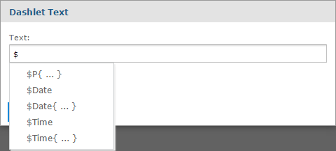

# Tips for Designing Dashboards

Charts and small crosstabs are best suited to dashboards. However, you can design table reports that work well in the dashboard. Such reports tend to be very narrow and are typically used with input controls to limit the number of rows they return.

Keep reports small because dashboards typically contain more than one. In particular, reports should not be too wide, as horizontal room is always at a premium in a dashboard. The server strips margins from an Ad Hoc report when displaying the report on a dashboard.

## Input Control Tips

When designing input controls for a dashboard, keep these guidelines in mind:

-   To pass a value to an external URL, the **URL Parameter Name** you give to the input control must match the name of a parameter that the URL can accept. The value of the input control must also be a value the URL can accept. The target URL is likely to have additional requirements and limitations. For example, the name of the parameter may be case-sensitive. In this case, the value you enter in the **URL Parameter Name** field is also case-sensitive.

The input control must pass data that the URL can accept. Otherwise, the server may be unable to retrieve the correct data from the external URL.

## Time-Date Wildcards

When creating dashlets, you can enter a wildcard into a text input field to display the current date or time:

-   ` $Date`: Displays the current date in the `Month Day, Year` format. For example, `January 15, 2019`. You can also customize how the date is displayed using the following parameters:

-   `$Date{MM-DD-YYYY}`. For example, January 15, 2019 is displayed as `01-15-2019`.

-   `$Date{DD/MM/YYYY}`. For example, January 15, 2019 is displayed as `15/01/2019`.

-   `$Date{dddd MMMM DD, YYYY}`. For example, January 15, 2019 is displayed as `Friday January 15, 2019`.

-   `$Time`: Displays the current time in the 12 hour format with `am/pm`, but without the leading `0` for hours. For example, `1:25 pm`. You can customize how the time is displayed using the following parameters:

-   `$Time{HH:mm}`. Displays the time in the 24 hour time format. For example, 1:25 pm is displayed as `13:25`.

-   `$Time{hh:mm a}`. Displays the current time in the 12 hour format with `am/pm` and the leading `0` for hours. For example, `01:25 pm`.

-   `$Time{HH:mm:ss}`. Displays the current time in the 24 hour time format with seconds. For example, 1:25:30 pm is displayed as `13:25:30`.

-   `$Time{hh:mm:ss a}`. Displays the current time in the 12 hour format with seconds, `am/pm`, and the leading `0` for hours. For example, 1:25:30 pm is displayed as `01:25:30 pm`.

-   `$Time{HH:mm:ss z}`. Displays the current time in the 24 hour time format with seconds and the time zone. The time zone is selected on the login page. For example, 1:25:30 pm in the Pacific Standard time zone is displayed as `13:25:30 PST`.

-   `$Time{hh:mm:ss a z}`. Displays the current time in the 12 hour format with seconds, `am/pm`, the time zone, and the leading `0` for hours. The time zone is selected on the login page. For example, 1:25:30 pm in the Pacific Standard time zone is displayed as `01:25:30 pm PST`.

The wildcards are available for text fields, image links, and web links, but it is not available for the dashlet name field.

When you type the `$` symbol into a dashlet's text box, a dropdown list with the time-date wildcards and other available parameters is displayed. Select the wildcard that you want from the list or continue typing to narrow down the list.

*Figure 1: Time-Date Wildcard Auto-complete*
