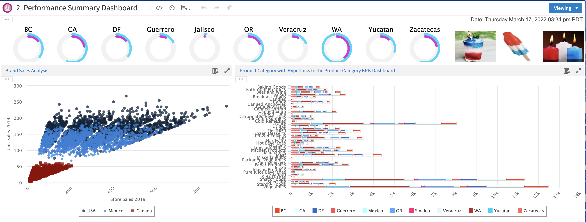

# Working with Dashboards

!!! info "Important"

    The features in this section may be restricted by your JasperReports Server software license. If you don't see some of the options described, your current license likely prohibits their use. Contact us to learn about your licensed features or to discuss upgrading.

A Jaspersoft dashboard displays several reports in a single, integrated view. A dashboard can include input controls for choosing the data displayed in one or more dashlets, and custom dashlets that point to URLs for other content. By combining different types of related content, you can create appealing, data-rich dashboards that quickly convey trends.

*Figure 1: Sample dashboard*

This chapter contains the following sections:

- [Viewing a Dashboard](dashboards-viewing.md)

- [Overview of the Dashboard Designer](dashboard-designer-overview.md)

- [Creating a Dashboard](dashboards-creating-simple.md)

- [Specifying Parameters in Dashlets](dashboards-parameters-in-dashlets.md)

- [Editing a Dashboard](dashboards-editing.md)

- [Scheduling a Dashboard](dashboards-scheduling.md)

- [Getting the Embed Code for Visualize.js](dashboards-get-embed-code.md)

- [Exporting Dashboards and Dashlets](dashboards-exporting.md)

- [Tips for Designing Dashboards](dashboards-input-control-tips.md)
