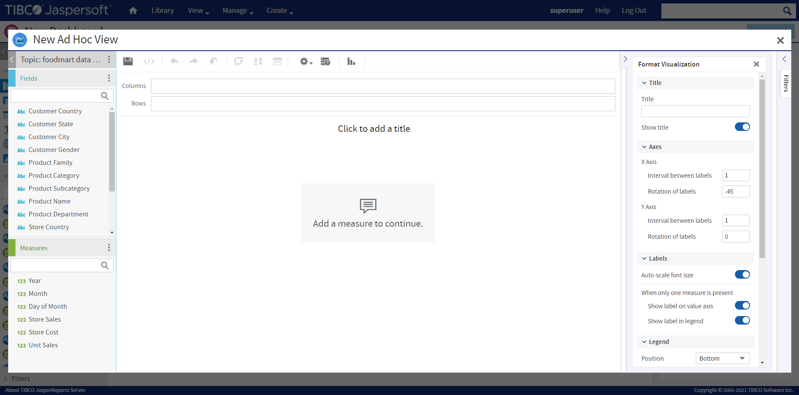

# Adding New Content

In addition to pre-existing reports and Ad Hoc views, you can create content for your dashboard directly from the Dashboard Designer, including:

-   Charts

-   Crosstabs

-   Tables

-   Text

-   Web page links

-   Images

## Adding Charts, Crosstabs, and Tables

The Dashboard Designer includes an embedded Ad Hoc Editor, which allows you to create charts, crosstabs, and tables for your dashboard without leaving the designer environment.

Any chart, crosstab, or table you create within the Dashboard Designer is available only on the current dashboard. Otherwise, they function like standard Ad Hoc Editor-created versions of these elements. They are saved as an Ad Hoc view and placed in a dashlet on your dashboard.

To add a new chart, crosstab, or table to your dashboard

1.  In the **New Content** section of the **Available Content** panel, click and drag the type of element you want to add to your dashboard (Chart, Crosstab, or Table) onto the dashboard canvas.

    The Ad Hoc Editor opens, and the **Select Data** dialog appears.

2.  Browse to or search for the data source that you want to use.

    -   Click  for a tree view of the files.
    -   Click  for a list view of the files.
    -   Use the text search field to locate a specific data source.

3.  Depending on your selected data source, the remaining steps may vary. Follow the displayed instructions. for more information about this process, see [1.0.1, “Ad Hoc Sources: Topics, Domains, and OLAP Connections,” on page 1](../adhoc/adhoc-topics-domains-olap.md).

4.  When you complete the data source selection process, click **OK**. By default the Ad Hoc Editor for New Layout Band opens.

    The embedded Ad Hoc Editor works just like the standard editor. For information on working with the editor, see [Chapter 1, “Working with the Ad Hoc Editor,” on page 1](../adhoc/adhoc-intro.md).

    

    *Figure 1: Embedded Ad Hoc Editor (New Layout Band)*

    

    *Figure 2: Embedded Ad Hoc Editor (Old Layout Band)*

5.  When you finish creating your view, click  to save.

6.  In the **Save to Dashboard** dialog, enter a dashlet name, and click **Save**. The dashlet is added to your dashboard.

## Adding Text

You can add a text field dashlet for titles and instructional text.

To add a text dashlet

1.  In the **New Content** section of the **Available Content** panel, click and drag the **Text** item onto your dashboard. The Dashlet Text window opens.

2.  Enter the text that you want to appear on your dashboard.

3.  Click **OK**. The dashlet is added to your dashboard.

    Edit the dashlet name and font appearance in Dashlet Settings. See [“Dashlet Properties” on page 1](dashboard-properties.md) for more information.

## Adding a Web Page

You can add a dashlet to display a web page on your dashboard.

To add a web page dashlet

1.  In the **New Content** section of the **Available Content** panel, click and drag the **Web Page** item onto your dashboard. The Dashlet URL window opens.

2.  Enter the URL that you want to appear on your dashboard.

3.  Click **OK**. The dashlet is added to your dashboard.

    Edit the dashlet name in Dashlet Settings. See [“Dashlet Properties” on page 1](dashboard-properties.md) for more information.

!!! note

    Only whitelisted web page domains URL are allowed. For more information, see Adding Dashboard Web Page Domain Whitelist Attributes to Server Attributes in the JasperReports Server Security Guide.

## Adding an Image

You can add a dashlet to display an image, such as a corporate logo, on your dashboard.

To add an image dashlet

1.  In the **New Content** section of the **Available Content** panel, click and drag the **Image** item onto your dashboard. The Dashlet URI window opens.

2.  Enter the URI for the image that you want to appear on your dashboard. Use the `repo:` syntax for images in your repository.

3.  Click **OK**. The dashlet is added to your dashboard.

    Edit the dashlet name in Dashlet Settings. See [“Dashlet Properties” on page 1](dashboard-properties.md) for more information.
