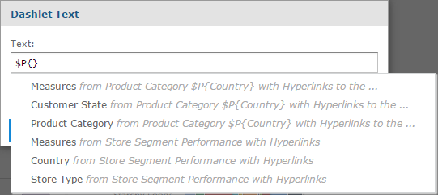
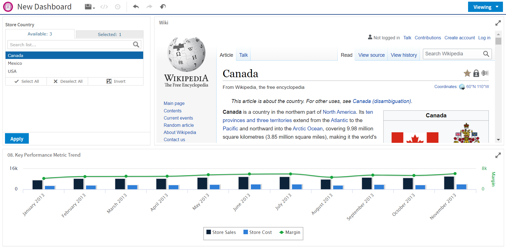

# Specifying Parameters in Dashlets

You can add parameters to dashlet names, text dashlets, web page dashlets, image dashlets, and hyperlinks in Ad Hoc viewdashlets. When you add a parameter, you must map a filter in the dashboard to the parameter. See [Mapping parameters in Parameter Mapping](#mapping-parameters-in-parameter-mapping) for more information.

Simple parameters

For the text dashlets, web links, and dashboard names, use the syntax `$P{parameter_name}` to directly pass the parameter value to the web page. Examples:

-   In a text dashlet, enter the parameter in the Text box:

    `Product Family: $P{Product Family}`

-   In a web page dashlet or a web link in an Ad Hoc view dashlet hyperlink, enter the parameter in the **Web Page Address (URL)** text box:

    `http://en.wikipedia.org/wiki/$P{Store Country}`

-   In a repository or web URI for an image dashlet, enter the parameter. Enter the parameter in the **Web Address/Repository URI** text box:

    `repo:/public/Samples/Reports/$P{Store Country}/flag.png`

-   Dashlet name: Enter the parameter in the **Dashlet Name** box:

    `Unit Sales for $P{Product Family}`

For repository hyperlinks in an Ad Hoc view dashlet, use the syntax `?filter_in_target=$P{dashlet_param}`. For example, the following link sets the c_country_1 input control in the 05. Unit Sales Trend report to the value of a Store Country parameter in the dashlet.

`repo:/public/Samples/Reports/05._Unit_Sales_Trend?c_country_1=$P{Store Country}`

!!! note

    To find the correct name for a filter in a target resource, open the Dashboard Designer in a new window, and add the resource to the canvas. Then expand the resource's folder in the Filters panel and hover over the filter whose name you want to see.

Parameters in multi-valued input controls

For multi-valued input controls, you can define a separator for the input control values:

-   For text dashlets, web links, and dashboard names, use the syntax $P{parameter_name ? "separator"}. The following example in a text box displays results like **Product Family: Drink + Food:**

    `Product Family: $P{Product Family ? " + "}`

-   For repository links in an Ad Hoc view or image dashlet, use the syntax `?$P{"filter_in_target=", dashlet_param, "&"}`.

    For example, the following link allows multi-select with the c_country_1 input control in the 05. Unit Sales Trend report:

    `repo:/public/Samples/Reports/05._Unit_Sales_Trend?$P{"c_country_1=", Store Country, "&"}`

When `Mexico` and `USA` are selected, this expands to the following link:

`repo:/public/Samples/Reports/05._Unit_Sales_Trend?c_country_1=Mexico&c_country_1=USA`

### Auto-complete parameters

When you type the `$` symbol into a dashlet's text box, a dropdown list of available parameters is displayed. Select a parameter from the list or continue typing to narrow down the list of parameters. The auto-complete parameters feature is available for text fields, image links, and web links, but it is not available for the dashlet name field.

*Figure 1 Text dashlet showing available parameters*

### Mapping parameters in Parameter Mapping

After you have created a parameter, create a mapping for it as follows:

Mapping parameters in dashboard names and text, image, or web page dashlets

1.  In the Dashboard Designer, click  to open Parameter Mapping.
2.  In the filter row where you want to add the new filter, click . A row containing new affected dashlet and filter/parameter dropdown menus appears.
3.  Using these new line-items, select the dashlet where you added a parameter, then select the parameter.
4.  Click **OK** to apply and save or **Cancel** to discard your changes.

Mapping parameters in Ad Hoc view hyperlinks

To have JasperReports Server create a parameter mapping automatically:

1.  In the Dashlet Settings of the Ad Hoc view dashlet, use one of the names in the **Available parameters** list as the name of your parameter.
2.  Click **OK** to close the dialog box and create the mapping.

To create a mapping in Parameter Mapping:

1.  In the Dashlet Settings of the Ad Hoc view dashlet, click **Create Links in Parameter Mapping...** to open Parameter Mapping.
2.  In the filter row where you want to add the new filter, click . A row containing new affected dashlet and filter/parameter dropdown menus appears.
3.  Using these new line-items, select the dashlet where you added a parameter, then select the parameter.
4.  Click **OK** to apply and save or **Cancel** to discard your changes.

## Creating a Web Page Dashlet

When working with Web Page dashlets in the Dashboard Designer, you can include a parameter reference in the dashlet's URL. The parameter references an existing filter in another dashlet, and uses that filter to display a specific web page relevant to the filtered information.

The following example takes you through the steps for creating a simple dashboard in the Dashboard Designer, adding a sample chart with geographic filters, and creating a Web Page dashlet that displays a Wikipedia page for the country the sample chart is filtered on.

First, create the simple dashboard

1.  Log in to JasperReports Server as superuser.

2.  Click **Create &gt; Dashboard**.

    The Dashboard Designer appears, displaying the list of available content and the canvas.

3.  In the **Existing Content** section of the Available Content panel, find report 08. Key Performance Metric Trend.

4.  Click and drag the report onto the Dashboard Canvas. Note that the **Filters** section now includes the 08. Key Performance Metric Trend folder.

Next, add the filter input control to the dashboard

1.  In the **Filters** section, expand the 08. Key Performance Metric Trend folder.

    The input controls associated with the 08. Key Performance Metric Trend report appears.

2.  Drag the Store Country input control onto the canvas.

Now, add the Web Page dashlet with the parameter reference and add it to the filter

1.  In the **New Content** section of the **Available Content** panel, click and drag the **Web Page** item onto your dashboard.

    The Dashlet URL window opens.

2.  Enter the following URL:

    `http://en.wikipedia.org/wiki/$P{Store Country}`

3.  Click **OK**.

4.  In the Dashlet Settings, change the Dashlet name to **Wiki**.

5.  Click **OK**.

6.  Click  the Ad Hoc menu to open Parameter Mapping.

7.  In the **Store Country** filter group, click .

    A row containing the new affected dashlet and filter/parameter dropdown menus appears.

8.  In the Dashlet Affected column, select **Wiki** from the new Select dashlet... dropdown menu.

9.  In the Filter/Parameter Affected column, select **Store Country** from the new Select parameter... dropdown menu.

10. Click **OK**.

Finally, preview the new dashboard functionality

1.  Click the **Editing** button and select **Viewing** to preview the dashboard.

2.  Click in the **Store Country** text box to display the available countries.

3.  Select **Canada** from the values list in the Store Country input controls, and click **Apply** at the bottom of the dashlet. The data in the Key Performance Metric Trend report is updated to display only information about Canada, and the wiki dashlet displays the Wikipedia page for Canada.

    In Figure 1-2 you can see how the dashboard preview looks at this point:

    

    *Figure 2 Dashboard with web page parameters*

4.  Click the **Viewing** button and select **Editing** to return to the Dashboard Designer.

5.  Click , then select **Save Dashboard**.

6.  In the Save As window, change the default name, New Dashboard to `Key Performance Metric Trend Dashboard` and locate a folder, such as the /Dashboards folder.

7.  Click **Save**.
