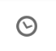
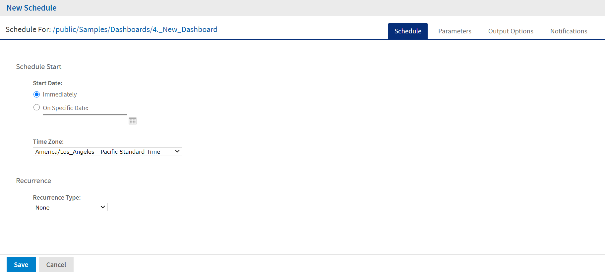

# Scheduling a Dashboard

You can schedule a dashboard from the dashboard view mode and the edit mode (dashboard designer).

To schedule a dashboard

1.  On the dashboard toolbar, click  to open the **New Schedule** dialog. 

    

    *Figure 1 New Schedule Dialog*

    The **New Schedule** dialog has the following tabs:

    -   Schedule – When to run the scheduled job, and how often.
    -   Parameters – If the dashboard was designed with input controls, which parameters the scheduled job uses.
    -   Output Options – The name of the output file, the output format and locale, and where the output file is stored.
    -   Notifications – Email options for sending the output to recipients and for sending administrative messages.

2.  Create the schedule, as described in [Creating a Schedule](../schedules/schedules-job.md).

3.  Click **Save**. The **Save** dialog appears.

4.  In the **Scheduled Job Name** field, enter a name for the job. The description is optional.

5.  Click **Save** to save the schedule. The job appears in the list of saved jobs for dashboards.

For information on viewing, modifying, or deleting the schedules, see [Scheduling Reports and Dashboards](../schedules/schedules-introduction.md).
