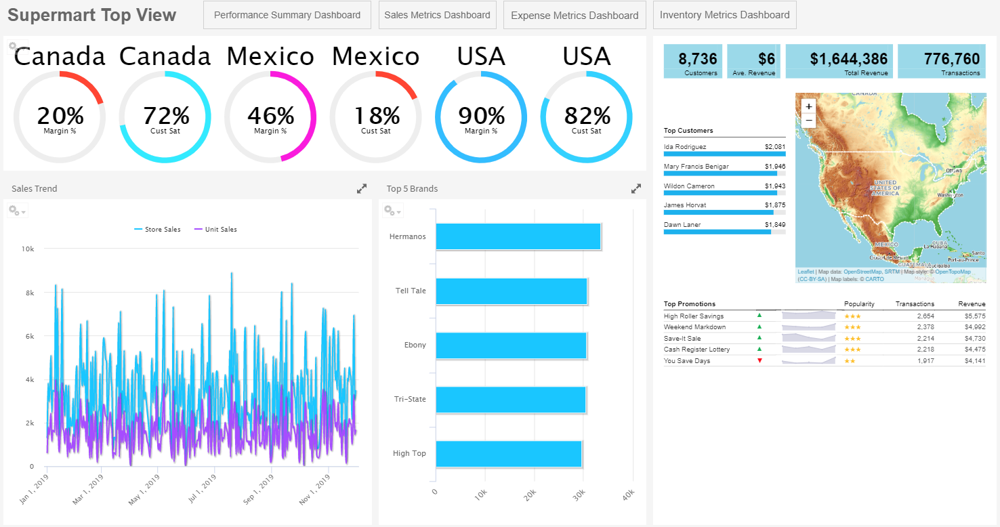

# Viewing a Dashboard

You can view a dashboard if you have the proper permissions. The following procedure walks you through opening one of JasperReports Server's samples, the Supermart dashboard.

To view the Supermart dashboard

1.  Log in as user `demo`, using the password `demo`.

    !!! note

        Passwords are case-sensitive. Use the lowercase when you type `demo`.

    The Supermart Top View dashboard opens in the dashboard viewer.

    

    *Figure 1 Supermart Dashboard Example*

2.  Click one of the **USA** gauges.

3.  Select **USA**, then click **Close** to change the data displayed. 
    The two dashlets with Country data update to display data for USA only.

    !!! note

        You can click the funnel icon to select one or more countries from a filter panel.

4.  Click the **Sales Metrics Dashboard**. 
    A new dashboard opens. The Sales Metrics Dashboard includes reports on sales by region, state, and city.

5.  On the **Sales Metrics Dashboard**, click **Back**  to return to the Supermart Dashboard.

    !!! note

        Use the **Back** button instead of the browser back button. This ensures the best experience with respect to the state of the previous page.

6.  When done, click **View &gt; Repository** to go to the repository page.

    !!! note

        If a dashboard does not appear when you click its name in the repository, it may already be open in another window or tab of your browser.

If you have the proper permissions, you can easily switch from viewing a dashboard to editing it.

To edit the Supermart dashboard

1.  Open the Supermart dashboard in the dashboard viewer.

2.  Click the **Viewing** button on the title bar and select **Editing** from the dropdown list.

3.  Edit the dashboard by adding, removing, resizing, or dragging content.

    For more information about working with dashboard content, see [“Creating a Dashboard” on page 1](dashboards-creating-simple.md).

4.  When you are satisfied with the dashboard, hover your cursor over  and select **Save Dashboard**. To create a new version of the dashboard, select **Save Dashboard As** and specify a new name.

    !!! note

        If you close the dashboard without saving the changes, you are prompted to save or cancel the changes made to the dashboard.
