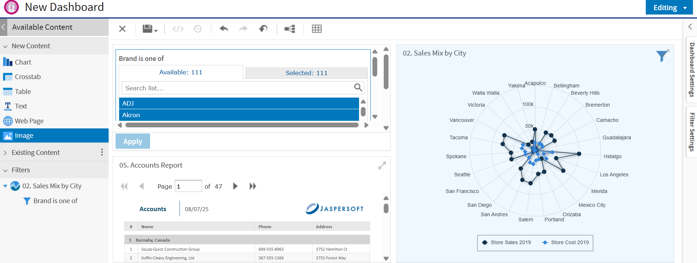

# Visualizing Dashboard Filters

You can now identify dependencies between dashboard filters and dashlets. When you apply a filter to the dashlet, click on the filter and you now can view the corresponding dashlets that are affected by that filter visually highlighted. This provides an immediate and clear indication of which data is being influenced by the selected filter.

 
