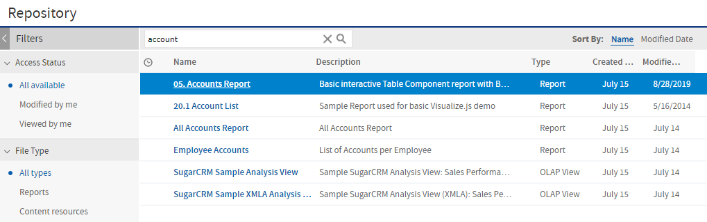

# Filtering Search Results

If you enter a search term and click  at the top of any server page, the server does not use filters. The search uses these default settings:

-   Include subfolders.

-   Start at the top-most folder visible to the user.

-   Search for reports, report outputs, OLAP views, or other resources.

-   Sort alphabetically by name.

If you click **View &gt; Search Results** and click the search results page, the server uses the filters you set in the **Filters** panel.

In Figure 1‑7, you can see the results of a search for the term “account” using the filters All available and All types.

*Figure 1: Search Field and Search Results*

!!! note

    The search term that you enter in the search field is not cleared automatically. To clear the search term, click the  icon in the search field.

You can refine a search using filters. For example, filters can help you find your most recently viewed reports. You can set each filter independently. You can set the following types of filters:

-   User

-   Resource

-   Access time

-   Scheduled report

The user filter has the following settings:

| Filter Setting | Description |
|----|----|
| All Available (default) | All resources. |
| Modified by me | Selects only resources that were last modified by the user who is logged in. |
| Viewed by me | Selects only resources that were run and viewed by the user who is logged in. This filter not only applies to visualization types, but also to resources that are included in reports such as images. |

The resource type filter has the following settings:

| Filter Setting | Description |
|----|----|
| All types (default) | All resources. |
| Reports | Displays only reports, both JRXML reports and Ad Hoc reports. |
| Report outputs | Displays only the output from reports that were scheduled or run in the background. Report output can be any of the supported export types, such as HTML and PDF. |
| Dashboards | Displays only dashboards. |
| OLAP views | Displays only analysis views (if you implement Jaspersoft OLAP). |
| Domains | Displays only Domains. |
| Data sources | Displays only data sources. |

The access time filter has the following settings. All times are relative to the user’s effective time zone:

| Filter Setting | Description |
|----|----|
| Any time (default) | All resources. |
| Today | Resources viewed or modified since the previous midnight. |
| Yesterday | Resources viewed or modified during the previous day ending at midnight. |
| Past week | Resources viewed or modified during the past 7 days, including today. |
| Past month | Resources viewed or modified during the past 30 days, including today. |

The scheduled report filter has the following settings:

| Filter Setting | Description |
|----|----|
| Any schedule (default) | All resources. |
| Scheduled | Only reports that have scheduled jobs. |
| Scheduled by me | Only reports that have jobs scheduled by the currently logged in user. |
| Not scheduled | Only reports that do not have scheduled jobs and all other resource types. |

Remember these do's and don'ts when searching for resources:

-   Do use word fragments.

-   Do search for the display name or part of the display name of a resource.

-   Do search for words or fragments in the description of a resource.

-   Do use multiple words.

-   Don’t search for folder names.

-   Don’t enter quotes around terms or symbols between terms.

-   Don’t worry about using upper- or lower-case letters in search terms.
