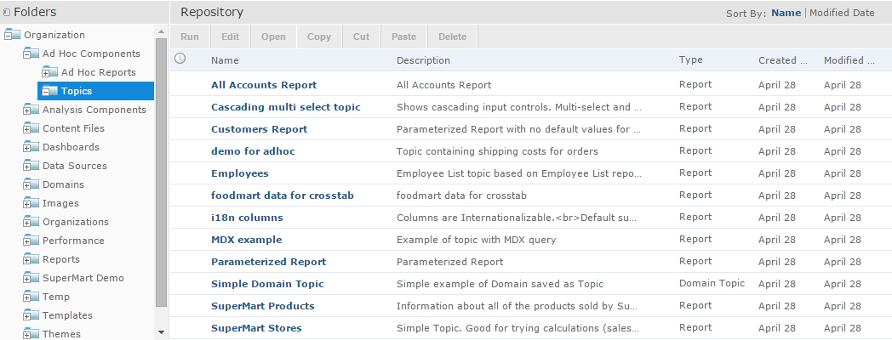
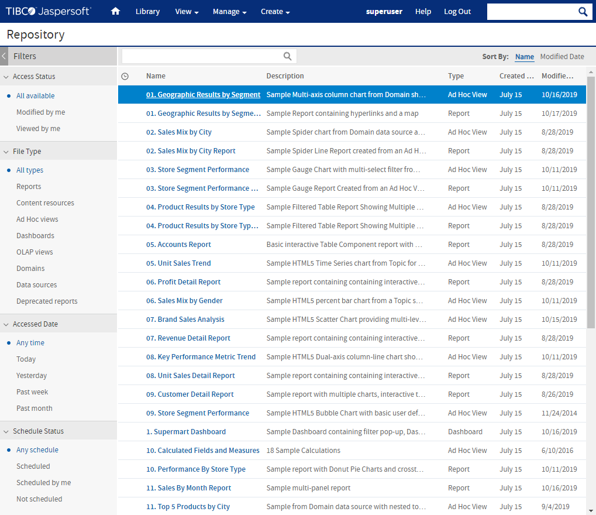

# Browsing the Repository

The repository is the server’s internal storage for reports, analysis views, and related files. The repository is organized as a structure of folders containing resources, much like a file system. However, unlike a file system, the repository is stored as a private database that only JasperReports Server can access directly.

To browse the repository, select **View &gt; Repository**. From the repository page, you can access the reports, themes, and other files stored on the server. You can browse the repository contents that you have permission to view by expanding the icons in **Folders**. Click a folder name to view its contents to see the Repository page as shown in Figure 1‑5.

*Figure 1: Repository Folders Panel*

# Searching the Repository

You can search the entire repository, subject to permissions, or narrow the search using filters. **Filters** restrict a search by name, who changed the resource, type of resource, date of the resource, and schedule.

## Searching the Entire Repository

To search the repository, select **View &gt; Search Results**. The search results page appears. Instead of only viewing resources by folder, use intuitive search criteria, such as who modified the resource and when, to find pinpoint resources.

On the search results page, use either the **Filters** panel or **Search** field to find resources. The search results page displays results of searches and filters.

*Figure 2: Search Results Page*

To search all resources in the repository

1.  Select one of these filters: **All available**, **Modified by me**, or **Viewed by me.**

2.  Click the  icon in the search field to clear the search term if there is one.

3.  Select **All types**, as shown in Figure 1‑6.

4.  Click .

    The search results appear listing files that your user account has permission to view. Click a resource in the list to view it or right-click a resource to see what functions are available from the context menu.

The server remembers your settings on the Search Results page, so the most commonly needed resources remain visible when you return to the page.
