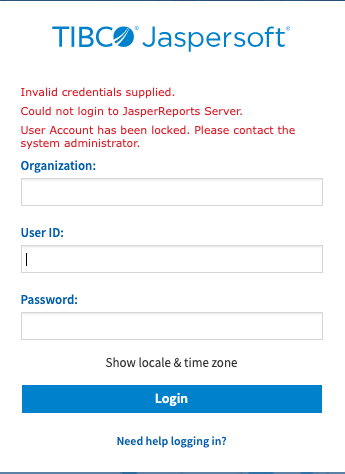

# Disabled Accounts

Failed login attempts can disable an account. The number of remaining attempts is displayed after a failed login attempt.

In the event of a disabled account due to multiple failed login attempts, contact your administrator to unlock the account.

Refer to the JasperReports Server Administrator Guide and JasperReports Server Security Guide for more information on disabling or limiting this feature.
