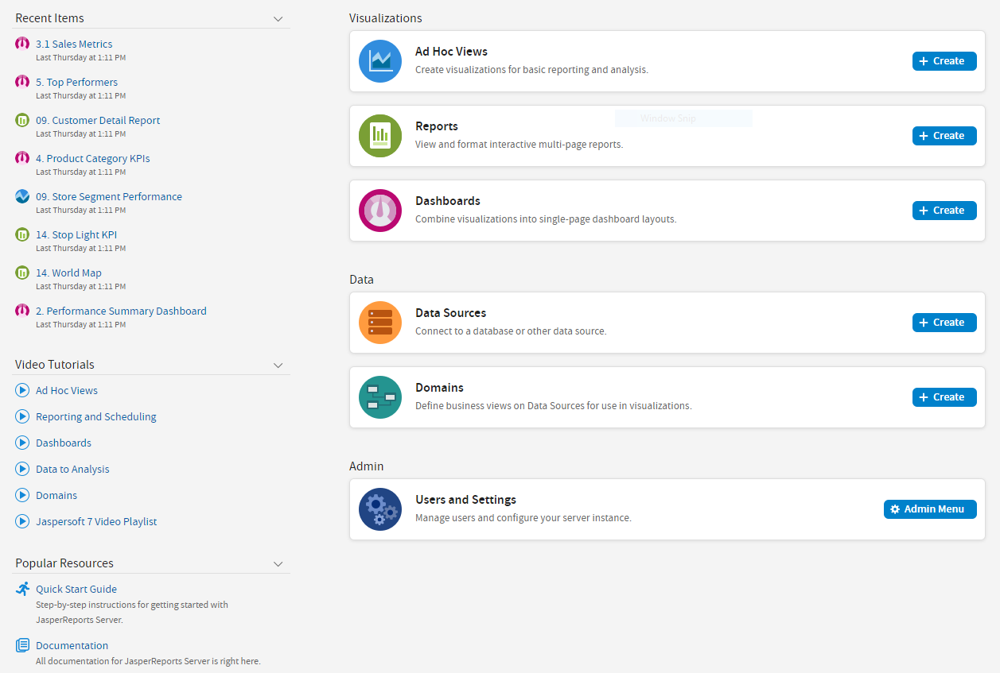

# The Getting Started Page

From the Getting Started page, you can quickly access the most frequently used features of the server.

*Figure 1: Getting Started Page*

## Core Workflows

The Getting Started page for standard users has multiple blocks that link to the core workflows of JasperReports Server that may include some or all the following options:

-   **Ad Hoc Views** - Select or create a visualization for basic reporting and analysis.

-   **Reports** – Create an interactive report from an Ad Hoc view, or select an existing report.

-   **Dashboards** - Combine related visualizations into a single-page layout, or select from existing layouts.

-   **Data Sources** - Select or define a connection to a database or other data source.

-   **Domains** - Add structure to your data source for use in a visualization.

-   **Users and Settings** - Configure your server instance and manage user settings. This block is visible only to users with administrator privileges.

Each workflow block on the Getting Started page may contain buttons linking to pages or wizards to create related elements. Each workflow block links to a filtered repository list containing relevant items. Click these blocks to access the resources. Users with administrator access may have more of these options available to them.

## The Getting Started Column

-   On the left side of the page, there are two lists to help you locate and access relevant information and assets. **Recent Items** - Includes links to up to five recently viewed repository items, such as reports, Ad Hoc views, and dashboards.

-   **Video Tutorials** - Includes links to video tutorials for various JasperReports Server features.

-   **Popular Resources** - Includes links to educational and support resources.

## Menu Items

The menu items along the top of the Getting Started page are available from every page on JasperReports Server. The Returns to the Getting Started page  and the Library, View, Manage, and Create menus offer the options described in the table below.

<table>
<colgroup>
<col style="width: 50%" />
<col style="width: 50%" />
</colgroup>
<thead>
<tr>
<th>
Menu
</th>
<th>
Description
</th>
</tr>
</thead>
<tbody>
<tr>
<td>
<strong></strong>
</td>
<td>
Returns to the Getting Started page.
</td>
</tr>
<tr>
<td>
Library
</td>
<td>
Displays a pared-down repository page that contains the Ad Hoc views, reports, and dashboards the currently logged in user has rights to
</td>
</tr>
<tr>
<td>
<strong>View</strong>
</td>
<td><ul>
<li><strong>Search Results</strong> - Displays the repository of resources filtered by criteria selected in the Filters panel.</li>
<li><strong>Repository</strong> - Displays the repository of files and folders containing resources, such as reports, report output, data sources, and images.</li>
<li><strong>Schedules</strong> - Lists the reports that you have scheduled.</li>
<li><strong>Messages</strong> - Lists system messages, such as an error in a scheduled report.</li>
</ul></td>
</tr>
<tr>
<td>
Manage
</td>
<td><ul>
<li><strong>Organizations</strong> - Opens the Manage Organizations page.</li>
<li><strong>Users</strong> - Opens the Manage Users page.</li>
<li><strong>Roles</strong> - Opens the Manage Roles page.</li>
<li><strong>Server Settings</strong> - Opens the Server Settings | Log Settings page.</li>
</ul></td>
</tr>
<tr>
<td>
<strong>Create</strong>
</td>
<td><ul>
<li><strong>Ad Hoc View</strong> - Launches the Ad Hoc Editor for designing views interactively.</li>
<li><strong>Report</strong> - Launches the Create Report dialog for creating a report based on an Ad Hoc view and a report template.</li>
<li><strong>Dashboard</strong> - Launches the Dashboard Designer for laying out multiple reports with input controls, labels, and images.</li>
<li><strong>Domain</strong> - Launches the Domain Designer for setting up a Domain.</li>
<li><strong>Data Source</strong> - Launches the New Data Source page for specifying the attributes of the new data source.</li>
</ul></td>
</tr>
</tbody>
</table>

If you log in as an administrator, the Home page has additional options and menu items for managing users, roles, organizations, and settings, such as repository folder names. Administrator functions are documented in the JasperReports Server Administrator Guide. The links to the **Online Help**, **Log Out**, and a search field appear on all JasperReports Server pages. For more information about searching, see [Filtering Search Results](intro-filtering-search.md).

## JasperReports Server Keyboard Shortcuts

JasperReports Server provides keyboard shortcuts to help you navigate its web UI without the use of a mouse or other pointing device. These shortcuts are available on the Login page, the Home page, the Library Page, the Repository page, the Search Results page, and the interactive Report Viewer, allowing you to log in, move between major navigational elements of these pages, select and open reports, and navigate tabular reports.

Shortcuts include:

| Key | Action |
|----|----|
| Left Arrow | Navigate left one column, cell, or item. |
| Right Arrow | Navigate right one column, cell, or item. |
| Up Arrow | Navigate up one row, cell, or item. |
| Down Arrow | Navigate down one row, cell, or item. |
| Enter | Select an item or navigate into an inner control. |
| Escape | Cancel an action or navigate out to an outer control. |
| Tab | Navigate to the next major region or the form field. Focus moves from left to right. |

Note that, on some pages, the Shift key can also be used with the arrow keys or Tab:

-   When used with the arrow keys, Shift multi-selects items, such as reports listed in the Library page.

-   When used with Tab, Shift changes the direction that focus moves from left to right to right to left.

In addition, the web UI has improved compatibility with screen readers, which assist visually impaired users in using computers. The implementation follows the WAI-ARIA (Web Accessibility Initiative Accessible Rich Internet Applications Suite) technical specification. WAI-ARIA has been certified for certain versions of JAWS (Job Access With Speech) with certain browsers:

-   Microsoft Edge with JAWS 2018 - 2021

-   Google Chrome with JAWS 2018 - 2021

For information on the compatible versions of browsers, see the Jaspersoft Platform Support Guide.

To increase JasperReports Server's accessibility further, we recommend that you enable the Easy Access theme, which increases color contrast and highlighting in the web UI. It can improve the user experience of those with visual impairment. For more information on the themes, see the JasperReports Server Administrator Guide.
