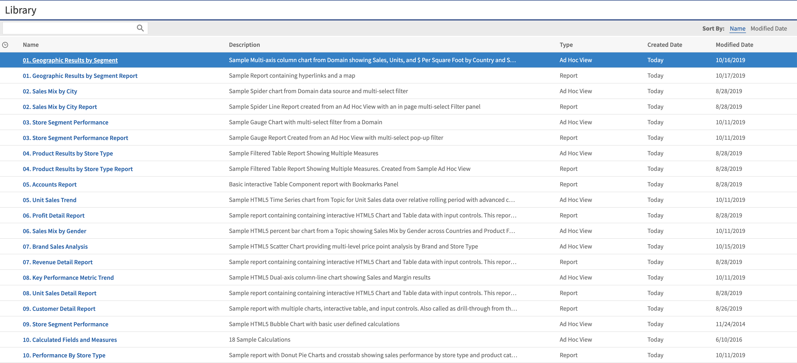

# The Library Page

The Library page offers a more focused view of the repository objects. It contains only the Ad Hoc views, reports, and Dashboards that the currently logged-in user has the rights to view and work with.

Click **Library** to view your Library list.

*Figure 1: Library Page*

From the Library page, you can:

-   Run and schedule reports.

-   Open Ad Hoc views and generate reports from them.

-   Run and edit dashboards.

All of these functions are available by right-clicking the item that you want to work with and selecting an action from the context menu.

## Created vs. Modified Dates

The Library table has two columns that refer to when the repository items were created and last modified.

Generally, the created date is earlier than the modified date. In some situations, however, the created date may be after the modified date. This can happen for one of two reasons:

-   When an existing report (A) is modified, then subsequently copied into a new report (B). In the Library list, report B’s created date is the day it was created, but its modified date reflects the last time report A was changed.

-   An existing report is exported from one system and imported into another. In the Library list, the reports created date is the date it was imported into the new system, and the modified date is the date it was last modified in the original system.
