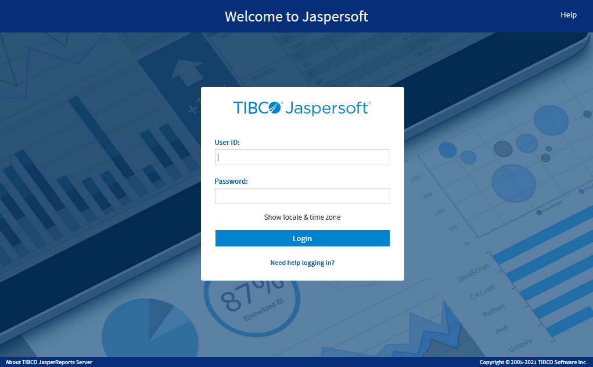

# Logging In

Launch JasperReports Server by entering `http://<hostname>:8080/jasperserver-pro` in a web browser, where `<hostname>` is the name of the computer that hosts JasperReports Server. The **Login** page appears.

*Figure 1: Jaspersoft Login Page*

!!! note

    To log in to the server, JavaScript and cookies must be enabled in your browser.

!!! warning

    Rhino JavaScript engine has been removed from JasperReports Server. With the removal of Rhino JS, reports created using JavaScript do not function unless you add Rhino JS back to your deployment. This can be done by stopping the web server, downloading version 1.7.14, which at the time of writing is not known to have any CVEs. This file can be replaced into the WEB-INF/lib folder, and reports that rely on JavaScript will again be functional.

Before logging in, review the information on the login page. There are links to the online help and additional resources.

You can log in as the following users:

-   **superuser/superuser** to manage configuration and organizations .

-   **jasperadmin/jasperadmin** to manage a single organization.

-   **joeuser/joeuser** to see an end user's view.

-   **demo/demo** to view the demo dashboard, if samples were installed.

!!! warning

    For security reasons, administrators should always change the default passwords immediately after installing JasperReports Server, as described in the JasperReports Server Administrator Guide.

To log in to the server

-   Enter your user ID and password.

    !!! note

        -   If you installed an evaluation server with the sample data, you can log in with the sample user IDs and passwords. For more information, click **Need help logging in?**

        -   If the Organization field appears in the Login panel, enter the ID or alias of your organization. If you don’t know it, contact your administrator. For more information, see [Logging into a Server with Multiple Organizations](intro_login_multi_org.md).

        -   The default administrator login credentials are superuser/superuser and jasperadmin/jasperadmin.

        -   If you are logging in using the REST API and your password has expired, an error message will be displayed.

1.  If you want to use a different locale and time zone than the server uses, click **Show locale & time zone**.

    The **Locale and Time zone** fields appear in the **Login** panel. Select your locale and time zone from the drop-down menus.

2.  Click **Login**.

    If you entered a valid user ID and password, the server displays the **Getting Started** page, as shown in [Getting Started Page](intro_getting_started.md).
