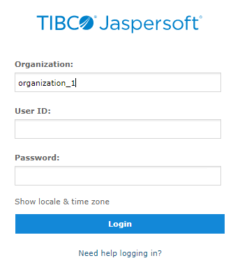
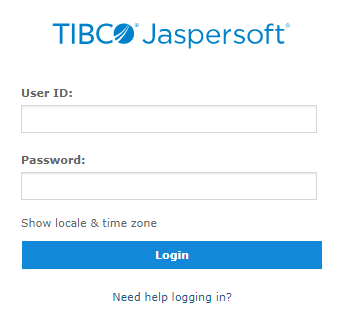

# Logging into a Server with Multiple Organizations

If the administrator has configured your server to use the multi-tenancy feature, it supports multiple organizations. Each organization has its own private area for storing files and resources. The default Login dialog for a multi-tenant server has an additional field: **Organization**. The left side of Figure 1‑2 shows this field. Enter the ID or alias of your organization. For example, enter the ID of the default organization: `organization_1`.

You don’t have to enter the organization ID each time you log in. The first time you log in, include the organization ID in your login URL, as shown on the right side of Figure 1‑2. Bookmark the URL and use it for subsequent logins. The **Organization** field does not appear in the dialog when you specify it in the URL.

<table>
<colgroup>
<col style="width: 50%" />
<col style="width: 50%" />
</colgroup>
<tbody>
<tr>
<td>
http://&lt;hostname&gt;:8080/jasperserver-pro/login.html 

</td>
<td>
http://&lt;hostname&gt;:8080/jasperserver-pro/login.html? 
orgID=organization_1

</td>
</tr>
<tr>
<td colspan="2">
<em>Figure 1: Login Methods for Multiple Organizations</em>
</td>
</tr>
</tbody>
</table>

The superuser account does not specify an organization because it is the system-wide administrator. If the **Organization** field appears in the Login dialog when you log in as a superuser, leave it blank. If you try to log in as a superuser with an orgID in the URL, the server returns an error.
