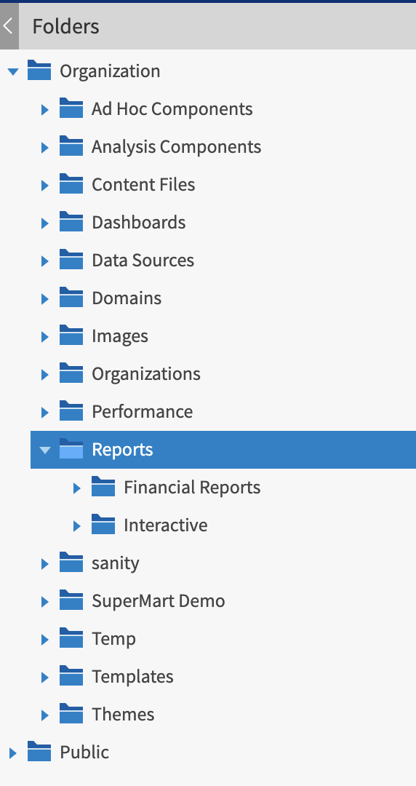

# Moving Folders

If you have read permission on folders and resources, you can copy and cut them from one folder and paste them to another if you have write permission on the destination folder. The server pastes all contents of the folder into the new location.

You can drag-and-drop the objects instead of using the paste menu item. Move folders one at a time. You can move other resources in batches.

!!! warning

    Relocated objects inherit permissions from the destination folder, losing the permissions in place before the move. To change permissions on an object, set the permissions explicitly.

To move folders and resources by cutting and pasting

1.  Log in to the server as a user who has these permissions:
    - Read permission on the folder or resource to move
    - Write permission on the destination folder 
      For example, log in as joeuser (use the password, joeuser).

2.  Click **View \> Repository**.

3.  In the **Folders** panel, right-click **Reports** \>**Samples** and select **Add Folder**.

4.  In the **Add Folder** dialog, enter a name, such as Financial Reports, and click **Add**.

    The Financial Reports folder appears as a subfolder of Samples and inherits Joe User’s default permissions (read-write-delete) on the parent folder.

    

    *Figure 1: New Financial Reports Folder*

5.  The Financial Reports folder deserves a more prominent location. Move it up one level:
    1.  In **Folders**, right-click Financial Reports, and select **Cut**.

    2.  Right-click **Reports**, and select **Paste**.

        The Financial Reports folder now appears in **Reports** at the same level as **Samples**.

        !!! note

            You can relocate a folder, subject to permissions, anywhere in the repository with one exception: The server doesn’t support copying and pasting a folder to the same location. If the Paste command is disabled when you right-click a destination folder, you don’t have write permission on the folder.
