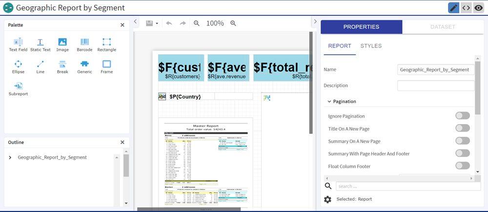

# Using Repository Resources

After finding a resource in the repository, naturally you want to do something with it. Options are:

-   Click the name of a report to run and view it.

-   Right-click the name of a resource to access other operations on the context menu, for example **Edit** or **Open in Designer**. Items appear on the context menu according to your permissions.

-   Click anywhere in the row except the resource name to select a resource. Ctrl-click anywhere in the rows to select multiple resources. Use the context menu or buttons above the results list: **Run**, **Edit**, **Open**, **Copy**, **Cut** (move), or **Delete**. If the button is unavailable, the resource does not support the operation or you do not have permission for the operation. For example, the Open button is available when you select a dashboard or an Ad Hoc report if you have permission to write to it. 
    You might also need permission to access the folder or dependent file, such as an image of a resource. For example, to schedule a report, you need to have read/write/delete permission on the folder where the server saves the report output. For more information about permissions, see the JasperReports Server Administrator Guide.

-   **Open In Editor** is available on the context menu when you right-click the reports and files. This editor opens text files like .css, .properties, .json, .xml, .csv, .jrtx, and .jrxml. In the case of the report unit, it shows a dialog with all the files from the report unit that you can open by clicking the file. For more information on the report unit, see [Overview of a Report Unit](../repo-upload-reports/repo-report-unit.md). 
    You can edit most of the files in the text editor while in the case of .jrxml files, a JRXML editor opens. For more information on JRXML editor, see [Jaspersoft Community Site.](https://community.jaspersoft.com/getting-started/jasperreports-web-studio/)

*Figure 1: JRXML Editor for JRXML File*

The following two icons may appear in the **Repository** panel:

-    - Indicates that the report has saved options for its input controls. Click the  icon to list the saved options. For more information, see [“Running a Report with Input Controls or Filters” on page 1](../reports/reports-input-controls.md).

-    - Indicates that the report is scheduled to run or is running in the background. Click this icon to view the list of jobs scheduled for the report. For more information, see [Scheduling Reports and Dashboards](../schedules/schedules-introduction.md).
