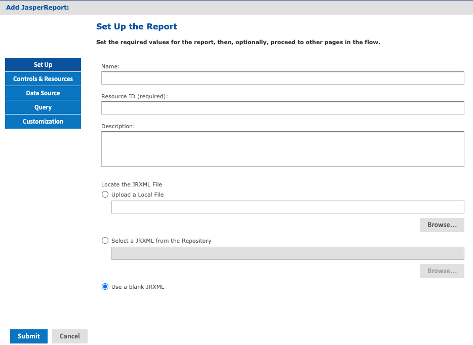
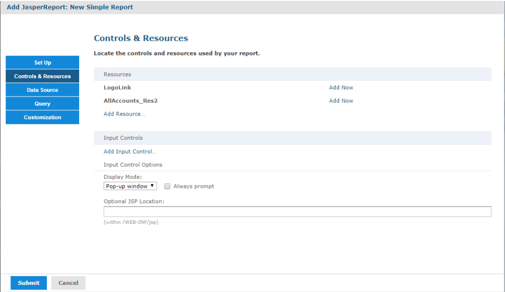

# Adding a Report Unit to the Server

This section presents an example of uploading a JRXML with resources to the server. This report has two images that need to be added.

## Selecting the Main JRXML File

If you want to validate the JRXML before uploading it, use Jaspersoft Studio. The server does not validate the JRXML when you upload it.

This procedure shows you how to set up a name for the report in the repository and select the main JRXML file that references all other elements.

To upload the main JRXML for this example

1.  Log in to the server as an administrator and select **View \> Repository**.

    !!! note

        If you log in as a user, you can upload a report unit to the server, but this example requires an administrator login to access the image resources.

2.  Locate the folder where you want to add the report. For example, go to **Public \> Samples \> Reports**.

3.  Right-click the Reports folder and select **Add Resource \> JasperReport**from the context menu. The Set Up the Report page of the JasperReport wizard appears.

    !!! note

        **Add Resource** appears on the context menu only if you have write permission to the folder.

4.  In **Naming**, enter the name and description of the new report and accept the generated Resource ID:

    - Name - Display the name of the report: `New Simple Report`

    - Resource ID - Permanent designation of the report object in the repository: `New_Simple_Report`

    - Description - Optional description displayed in the repository: `This is a simple example`.

5.  Select **Upload a Local File** and **Browse** to \<js-install\>/samples/reports/AllAccounts.jrxml.

    !!! note

        This example shows how to upload a JRXML file from the samples folder in the installation directory. You can also **Select a JRXML from the Repository** or **Use a blank JRXML**. On selecting the **Use a blank JRXML** option, a report unit with blank JRXML is saved after clicking **Submit**. This blank JRXML is then opened in an embedded JasperReports Web Studio, which gives you the ability to create pixel perfect reports from JasperReports Server.

    In Required Set Up Values, you can see the Set Up the Report page.

    

    *Figure 1: Required Set Up Values*

6.  Click **Controls & Resources**.

    The Controls & Resources page appears. If the server detects that the report needs additional resources, then you are prompted to locate those resources.

    

    *Figure 2: Suggested Resources in the Resources List*

    A JRXML file does not embed resources, such as images. When the server uploads the JRXML, it tries to detect any missing resources. For example, the Suggested Resources in the Resources List shows that two image files are missing:

    - LogoLink
    - AllAccounts_Res2
