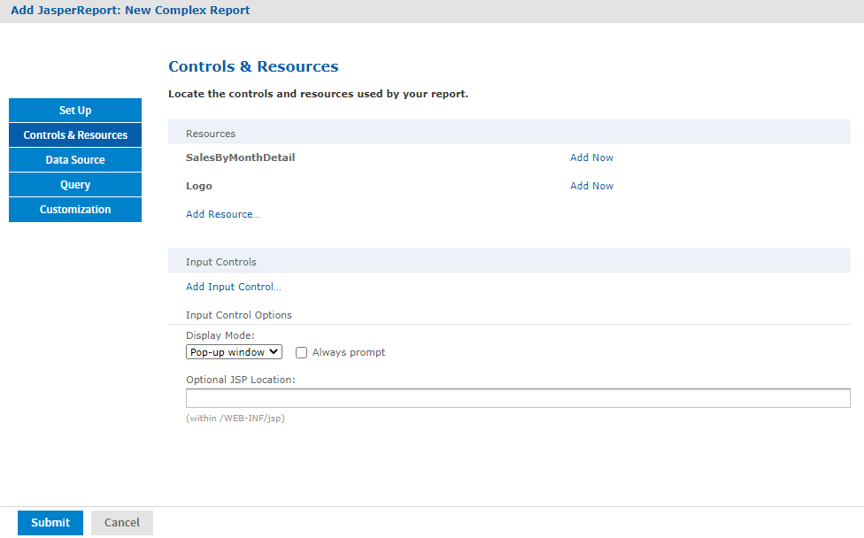

# Adding a Complex Report Unit to the Server

This section includes an example of how to add a report unit with all these resources:

- SalesByMonth.jrxml - The main JRXML file.
- SalesByMonthDetail.jrxml - The subreport.
- sales.properties - An English resource bundle file.
- scriptlet.jar - A scriptlet class JAR file.
- JR Logo - An image in the repository.
- JServer JNDI data source - A data source file in the repository.

These resources are part of the sample data installed with the server. To complete this example and run the report without server errors, you need access to these resources.

The example also guides you through defining every type of input control:

- Text
- Checkbox
- Dropdown
- Date
- Query

If you are not interested in creating all types of input controls, but want to work through part of the example, then delete parameters for the input controls that you do not want to create before you run the report.

The complex report that you create in this example is almost exactly like the SalesByMonth report in the **Reports** folder of the repository.

To upload the main JRXML and suggested resource files for the complex report unit

1.  Log into JasperReports Server as administrator and select **View \> Repository**.

    !!! note

        If you log in as a user, you can upload a report unit to the server, but this example requires an administrator login to access the image resources.

2.  Navigate to the folder containing your report. For example, navigate to **Organization \> Reports**.

3.  Right-click the Reports folder and select **Add Resource \> JasperReports®** from the context menu. The Set Up the Report page appears.

    !!! note

        **Add Resource** appears on the menu only if you have write privilege to the folder.

4.  Enter these properties:

    - Name - `New Complex Report`
    - Resource ID - `New_Complex_Report`
    - Description - `This is a complex report`

5.  Select **Upload a Local File**and **Browse** to \<js-install\>/samples/reports/SalesByMonth.jrxml.

6.  Click **Controls & Resources**. 
    The Controls & Resources page in Figure 5‑11 suggests resources to be uploaded for the report:

    - A sub-report (the SalesByMonthDetail.jrxml file)

    - A logo image

    

    *Figure 1: Suggested Resources for the Complex Report*

7.  On the Controls & Resources page, upload the sub-report:

    1.  Click **Add Now**in the SalesByMonthDetail row. The Locate File Resource page appears.
    2.  Select **Upload a Local File**.
    3.  Click **Browse** and locate the file \<js-install\>/samples/reports/SalesByMonthDetail.jrxml. Select SalesByMonthDetail.jrxml. 
        The path to SalesByMonthDetail.jrxml appears in the **Upload a Local File** field.
    4.  On the Locate File Resource page, click **Next**.
    5.  On the Add a Report Resource page, click **Next** to accept the default report resource name and resource ID.

8.  On the Controls & Resources page, upload the logo image resource:

    1.  Click **Add Now** in the Logo row. The Locate File Resource page appears.
    2.  On the Locate File Resource page, click **Select a resource from the Repository**.
    3.  Click **Browse**to locate the file /Images/JR Logo and select JR Logo.
    4.  Click **Next**. The Add a Report Resource page appears.
    5.  On the Add a Report Resource page, click **Next** to accept the default name, resource ID, and description.
