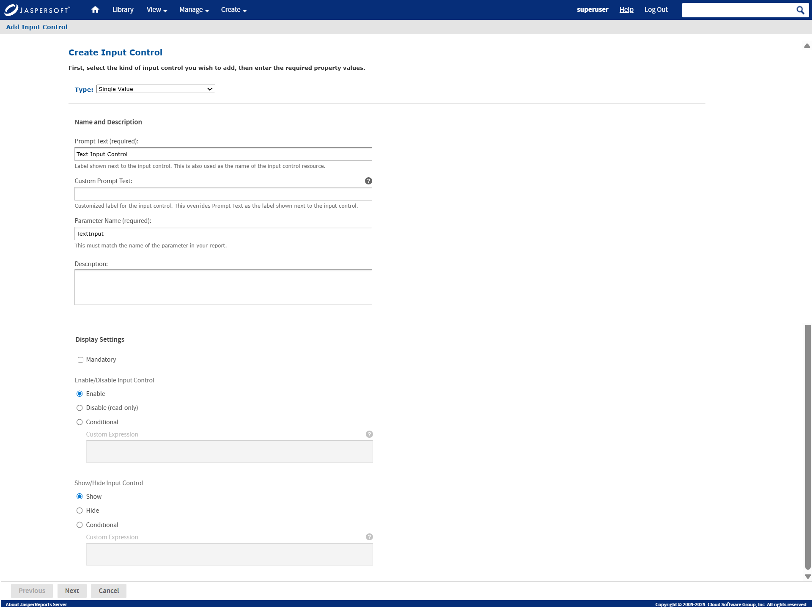
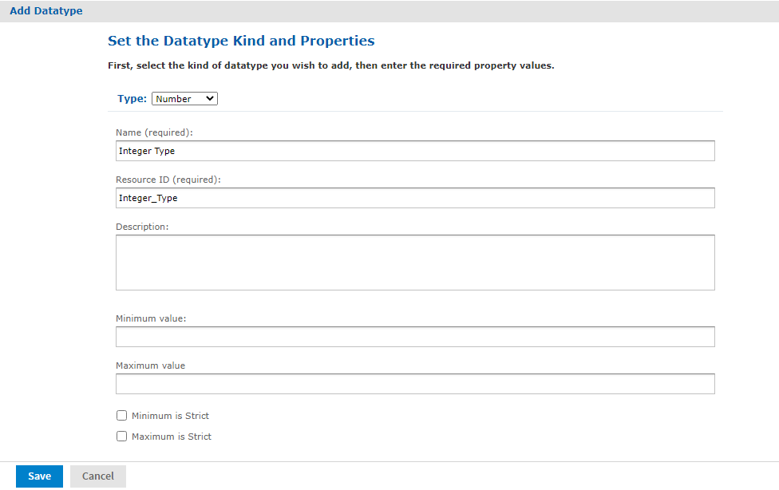
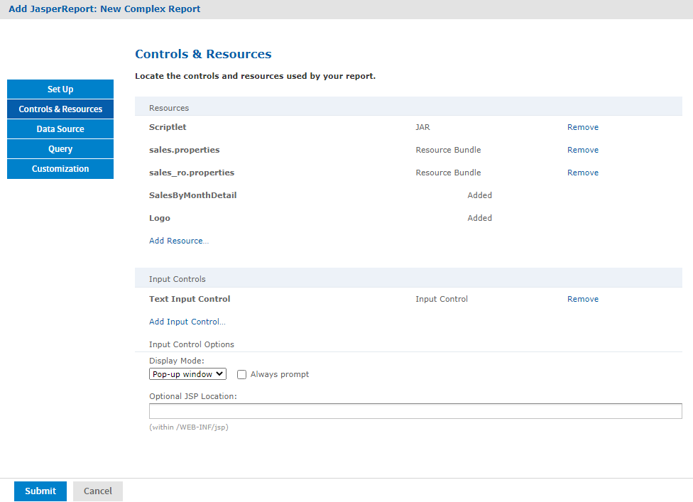
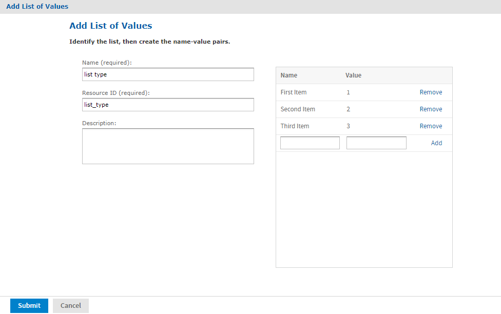
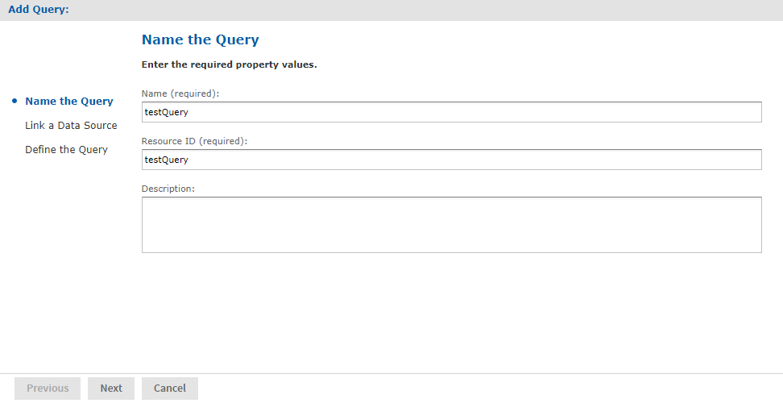
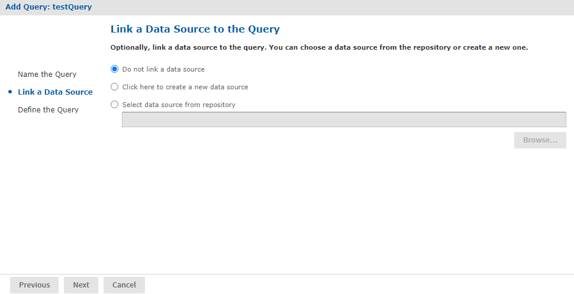
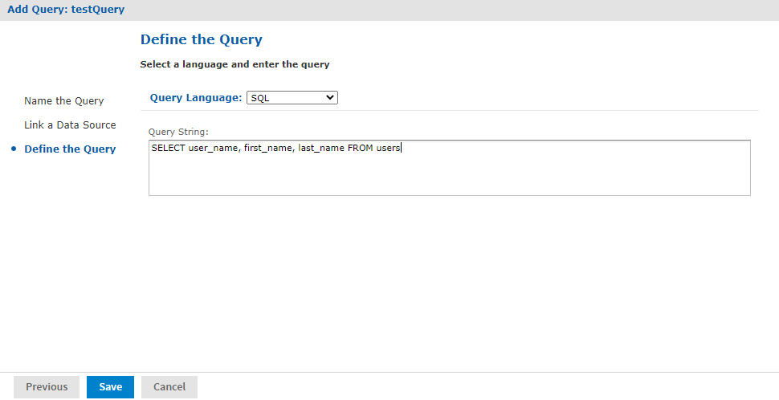
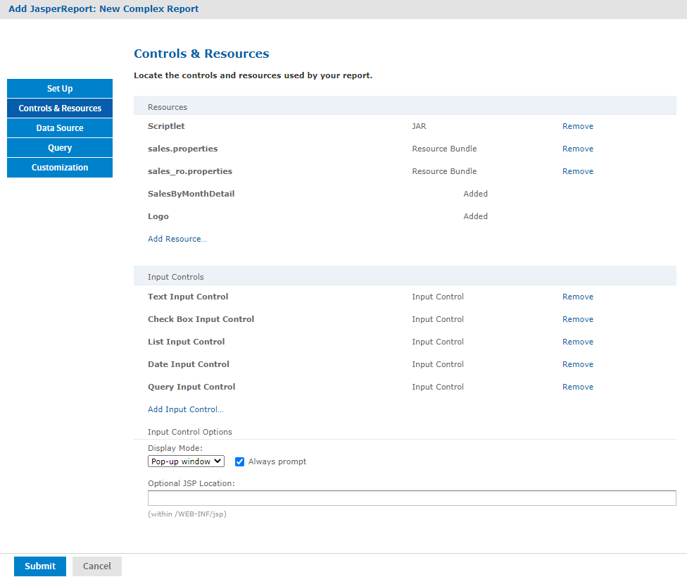

# Adding Input Controls

Input controls are graphical widgets that the server displays with the report. Input controls perform the following functions:

- Prompt the user for input.

- Validate the format of the input.

- Pass the input to the report.

Based on the input, the server modifies the WHERE filter clauses in SQL parametrized queries.

Input controls correspond to the parameters defined in JRXML reports, such as `$P{name}`. The server maps the value that the user enters for the input control to the parameter of the same name. If you define an input control in the JasperReport and the server cannot find a parameter by the same name in the JRXML, then the input control does not function when the report runs.

!!! note

    The JRXML can define a default value for the input control. To prevent users from changing the default, you can make the input control read-only or invisible.

When you create an input control, you provide a datatype. Datatypes define the expected input (numbers, text, date, or date/time) and can include range restrictions that the server enforces. The server uses the datatype to classify and validate the data.

To define a datatype, set properties on the **Set the Datatype Kind and Properties** page. Properties differ for other datatypes that appear on the page.

|  |  |
|----|----|
| Type | The classification of the data, which can be `Text`, `Number`, `Date`, or `Date-Time`. |
| Name | The name of the datatype. |
| Resource ID | The unique ID of the datatype that you cannot edit. |
| Description | Any additional information that you provide about the datatype. |
| Pattern | A regular expression that restricts the possible values of the field for the `Text` data type. |
| Minimum value | The lowest permitted value for the field. |
| Maximum value | The highest permitted value for the field. |
| Minimum Is Strict | If checked, the maximum value itself is not permitted. Only values less than the maximum value are permitted. |
| Maximum Is Strict | If checked, the minimum value itself is not permitted. Only values greater than the minimum value are permitted. |

After determining the list of values to be presented to the user, choose one of these widget types for the input control:

- Boolean: A checkbox widget for entering a yes/no value.

- Single value: A text, number, date, or date/time widget. Input can be constrained to a minimum value, maximum value, or both. Text input can also be constrained by a matching pattern. A text box widget for entering a value, or a calendar for selecting the date and date/time.

- Multiple values: To present a static or a dynamic list of values to the user, choose one of these:

  - Drop-down list to select a single value.

  - Radio buttons to select a single value.

  - Multi-select list to select multiple values.

  - Checkboxes to select multiple values.

The query in the `SalesByMonth.jrxml` file has several input control parameters, one for each type of input control. These procedures show you how to add each type to the report unit.

## Adding a Text Input Control

The simplest input control is a text box. In this example, the datatype for the input value is a number. The server verifies that the user enters a number into the text box.

To add a text input control to the complex report example

1.  After completing the steps in [Uploading Undetected File Resources](repo-undetected-file-resources.md), click **Controls & Resources** in the JasperReport wizard.

2.  On the **Controls & Resources** page, click **Add Input Control**. The **Locate Input Control** page appears.

3.  Select **Define an Input Control in the next step**.

4.  Click **Next**.

5.  On the **Create Input Control** page, from the **Type** drop-down, select the default (**Single Value**) .

6.  Enter the other properties for the input control: 
    The name is referenced in the main JRXML file, so enter it exactly as shown.

    - **Prompt Text**: Displays the label the user sees next to the widget for this input: `Text Input Control`

    - **Custom Prompt Text**: Allows you to write an expression or call a custom function to change the Input Control title dynamically: leave blank in this example.

    - **Parameter Name**: Displays the name of the report parameter that receives the user value: `TextInput`

    - **Description**: Displays the description (optional) within the report wizard: leave blank in this example.

    - **Mandatory**, **Enable/Disable Input Control**, **Show/Hide Input Control**: A setting that determines how the input control appears: Default selection in this example.

    

    !!! note

        To reuse an input control, add it to the repository independent of any report using **Add Resource \> Input Control**. Before using the input control in a report, check that the parameter name in the JRXML matches the name in the **Create Input Control** page. If it does not, then the server cannot run the report.

7.  Click **Next**.

8.  In **Locate Datatypes**, select **Define a DataType in the next step** and click **Next**:

    !!! note

        Instead of defining a datatype, you can use one in the repository if its type and range are compatible with your input control.

9.  In **Set the Datatype Kind and Properties**, enter the properties for the datatype:

    1.  In **Type**, select **Number** from the drop-down as the type of data the user can enter.

        !!! note

            The number format allows users to enter integers and decimals.

    2.  **Enter a name**: `Integer Type`.

    3.  **Enter a resource ID**: `Integer_Type`. 
        The name and resource ID are required, but are visible only when defining the input control.

         

    4.  Leave these properties blank in this example:

        - **Description**: An optional description that appears only within the report wizard.

        - **Minimum value**: The lower bound of the value the user may enter.

        - **Maximum value**: The upper bound of the value the user may enter.

        - **Minimum is strict**: Means the minimum value itself is not allowed.

        - **Maximum is strict**: Means the maximum value itself is not allowed.

10. Click **Save**.

    The **Controls & Resources** page now lists the Text Input Control.

    

## Adding a Simple Checkbox Input Control

A checkbox input control accepts true/false (boolean) input from the user.

To add a simple checkbox input control to the complex report example

1.  Continuing with the previous example, on the **Controls & Resources** page, click **Add Input Control**.

2.  On the **Locate Input Control** page, click **Define an Input Control in the next step**.

3.  Click **Next**.

4.  On the **Create Input Control** page, select **Boolean** from the **Type** drop-down.

5.  Enter the other properties:

    - **Prompt Text**: `Checkbox Input Control`.

    - **Custom Prompt Text**: Leave blank in this example.

    - **Parameter Name**: `Checkbox Input`. Enter the parameter name exactly as shown because the main JRXML file references this name.

    - **Description**: Leave blank in this example.

    - **Mandatory**, **Enable/Disable Input Control**, **Show/Hide Input Control**: Default selection in this example.

6.  Click **Submit**. The **Controls & Resources** page appears with the new checkbox input control.

## Adding a Drop-down Input Control

The drop-down input control also called a list, gives the user a pre-determined list of choices. As a report designer, you can choose a drop-down input control based on:

- To present a single-select or multi-select list to the user.

- To present a single choice as a drop-down list or a set of radio buttons.

- To present a multi-select control as a multi-select list or a set of checkboxes.

Radio buttons and checkboxes usually work well for five or fewer choices. This example shows how to create an input control that presents three choices in a drop-down list. You can create a new list of values for this input control or use a list of values in the repository.

To add a drop-down input control to the complex report example

1.  Continuing with the previous example, on the **Controls & Resources** page, click **Add Input Control**.

2.  On the **Locate Input Control** page, click **Define an Input Control in the next step**.

3.  Click **Next**.

4.  On the **Create Input Control** page, select **Single-select List of Values** from the **Type** dropdown.

5.  Enter the other properties:

    - **Prompt Text**: `List Input Control`.
    - **Custom Prompt Text**: Leave blank in this example.
    - **Parameter Name**: `ListInput` Enter the parameter name exactly as shown because the main JRXML file references this name.
    - **Description**: Leave blank in this example.
    - **Mandatory**, **Enable/Disable Input Control**, **Show/Hide Input Control**: Default selection in this example.

6.  Click **Next**.

7.  On the **Locate List of Values** page, select **Define a list of values in the next step**.

    !!! note

        Instead of defining a list of values, you can use one in the repository if its values are compatible with the parameters defined in the JRXML report.

8.  Click **Next**.

9.  On the **Add List of Values** page, provide the name, resource ID, and optional description for the list of values. These properties are not visible outside of the input control. Enter these values:

    - **Name**: `list type`
    - **Resource ID**: `list_type`
    - **Description**: Leave blank in this example.

10. In the **Name Value** panel, enter names and values to present as choices to the user:

    - Enter unique names. The server requires unique names to distinguish which item the user chose.
    - Enter values of the type that match the parameter definition in the JRXML report.

    After entering a name and value, click **Add**. If you make a mistake click **Remove**.

    For this example enter:

    - Name **First Item** with value **1**.
    - Name **Second Item** with value **2**.
    - Name **Third Item** with value **3**.

    

11. Click **Submit**. The **Controls & Resources** page appears with the new List Input control.

## Adding a Date Input Control

This example uses a datatype from the sample data in the repository.

To add a date input control to the complex report example

1.  On the **Controls & Resources** page, click **Add Input Control**.

2.  On the **Locate Input Control** page, select **Define an Input Control in the next step**, then click **Next**.

3.  On the **Create Input Control** page, select **Single-Value** from the **Type** drop-down.

4.  Enter the other properties:

    - **Prompt Text**: `Date Input Control`.
    - **Custom Prompt Text**: Leave blank in this example.
    - **Parameter Name**: `DateInput` Enter the parameter name exactly as shown because the main JRXML file references this name.
    - **Description**: Leave blank in this example.
    - **Mandatory**, **Enable/Disable Input Control**, **Show/Hide Input Control**: Default selection in this example.

5.  Click **Next**.

6.  On the **Locate Datatypes** page, select **Select a Datatype from the Repository**.

7.  Click **Browse**.

8.  In **Select Resource from Repository**, expand **Input Data Types**, and select the **Date Datatype**.

9.  Click **Select**. The **Locate DataTypes** page shows the location of this datatype in the repository, `/datatypes/DateDatatype`.

10. Click **Next**. The **Controls & Resources** page appears with the new Date Input Control.

## Adding a Query-Based Input Control

A query-based input control presents a dynamically created list of choices to the user. The server performs a query whose results are used to create the list of choices. You must perform the following tasks:

- Configure the query.

- Designate how to display the results in the input control.

- Specify the value to pass as the corresponding parameter.

To add a query-based input control to the complex report example

1.  On the **Controls & Resources** page, click **Add Input Control**.

2.  On the **Locate Input Control** page, select **Define an Input Control in the next step**.

3.  Click **Next**.

4.  On the **Create Input Control** page, select **Single-select Query** from the **Type** drop-down.

5.  Enter the naming properties for the input control:

    - **Prompt Text**: `Query Input Control`
    - **Custom Prompt Text**: Leave blank in this example.
    - **Parameter Name**: `QueryInput` Enter the parameter name exactly as shown because the main JRXML file references this name.
    - **Description**: Leave blank in this example.
    - **Mandatory**, **Enable/Disable Input Control**, **Show/Hide Input Control**: Default selection in this example.

6.  Click **Next**. The **Locate Query** page appears. The available options are:

    - To locate a reusable query in the repository
    - To define a new query dedicated to this input control

7.  For this example, select **Define a Query in the next step.**

8.  Click **Next**.

9.  On the **Name the Query** page, enter the naming properties for the new query. For this example, enter `testQuery` in both the **Name** and **Resource ID** fields.

    

10. Click **Next**. The **Link a Data Source to the Report** page appears. The available options include:

    - To use the same data source for the input control as you use for the report.
    - To define a new data source, dedicated to this input control.
    - To select a reusable data source from the repository.

11. For this example, select **Do not link a data source** to use the same data source for the input control as you use for the report. You will select the data source for the report in [Selecting a Data Source for Running the Complex Report](repo-data-source-complex-report.md).

    

    Click **Next**.

    On the **Define the Query** page, select **SQL** from the **Query Language** drop-down.

    Enter this Query String to retrieve the labels and values to be displayed for this input control:

    `SELECT user_name, first_name, last_name FROM users`

    

12. Click **Save**.

13. For each row in the results of the query, the server presents a single value, such as Sarah Smith, in the input type widget (drop-down, radio buttons, multi-choice, checkboxes). On the **Query Information** page, name the database columns to comprise the input value presented to the user. The column names must exactly match those in the `SELECT` clause of the query string:

    1.  In the **Value Column**, enter the `user_name.`
    2.  In the **Visible Column**, enter `first_name.`
    3.  Click **Add**.
    4.  In the **Visible Column**, enter `last_name.`
    5.  Click **Add**. 
        For each column you want to display as a choice, enter the name then click **Add**. If you make a mistake, click **Remove**.

14. Click **Submit**. The **Controls & Resources** page displays all the resources, including the new input controls. Input Controls and Resources shows these resources.

## Setting the Input Control Options

In this procedure, you set the display mode in **Input Control Options** at the bottom of the **Controls & Resources** page. Input Controls and Resources shows these options.

To configure the appearance of the input controls for the complex report example

1.  Select a **Pop-up window**.

    !!! note

        You can also select:

        - **Separate page**: To display the input controls in a separate browser window.

        - **Top of page**: To display them above the report:

        - **In page**: To display them on the side of the report.

2.  Select **Always prompt** when you want the server to display the **Input Controls** dialog to prompt the user when the report runs.

    !!! note

        The definition of input controls in this example specified **Visible** and not **Mandatory**. When input controls are not mandatory and the **Always prompt** is not selected on the **Controls & Resources** page, the user must click the **Options** button in the **Report Viewer** to change input controls. Otherwise the report runs with default input controls.

3.  Leave **Optional JSP Location** blank for this example. 
    You can use the Optional JSP Location option to specify the path to a JSP file that affects the appearance of the input controls.

Select the data source to finish the complex report example.
