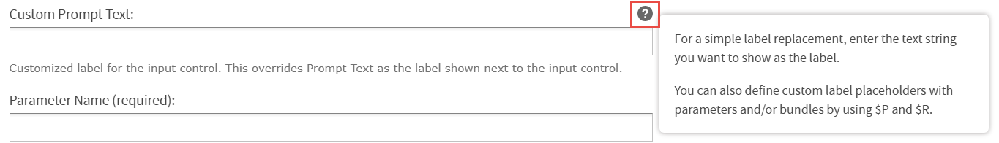

# Input Controls with Custom Expressions

You can add custom Input Controls from the following sections on the **Create Input Control** page:

- **Name and Description**:

  - **Custom Prompt Text**: This is an optional field and can be used to explain users how to use the Input Control. It can also be used to provide a customized label for the input control instead of **Prompt Text**. It enables you to write an expression or call custom function to change the Input Control title dynamically.

    For example:

    Simple label for string: `‘String’`

    Custom label: `$P` or `$R`

    A tooltip appears when you hover over the question mark icon.

    

- **Display Settings**:

  - **Enable/Disable Input Control \> Conditional**: This section enables you to control editing the value of the Input Control. Based on the condition defined, you may or may not be able to edit the value of the Input Control. When selected, the associated **Custom Expression** input is enabled.

    A tooltip appears when you hover over the question mark icon next to the **Conditional \> Custom Expression** input field.

    

  - **Show/Hide Input Control \> Conditional**: This section determines the visibility of the Input Control. Based on the condition defined, the Input Control may be shown or hidden. When selected, the associated **Custom Expression** input field is enabled.

    The tooltip is also displayed when you hover over the question mark icon next to the **Conditional \> Custom Expression** input field.

Following are the expression formats for **Custom Expression**:

|                        |                      |
|------------------------|----------------------|
| Input Control Type     | Expression Format    |
| Single value number    | IC name == value     |
| Single value string    | IC name == 'value'   |
| Single value date      | IC name == d'value'  |
| Single value time      | IC name == t'value'  |
| Single value timestamp | IC name == ts'value' |

## Supported Expressions

The supported expressions include:

- Comparisons: \<, \>, \<=, \>=, ==

- Addition, Subtraction: +, -

- Multiplication, Division: \*, /

- Function call

- Relative dates

### Expression Formats Accepted

<table>
<colgroup>
<col style="width: 50%" />
<col style="width: 50%" />
</colgroup>
<tbody>
<tr>
<td>Input Control Type</td>
<td><strong>Expression Format Accepted</strong></td>
</tr>
<tr>
<td>
Single Value

(String/ Number/ Date/ Time/ DateTime)
</td>
<td><ul>
<li>
Filter_By == 'Store Manager'
</li>
<li>
StoreId == 1
</li>
<li>
StartDate &gt; d'2005-01-01'
</li>
<li>
StartTime == t'04:46:18'
</li>
<li>
DateOpened &gt; ts'2005-11-30 19:19:05
</li>
<li>
Birthdate == DATERANGE(‘DAY’)
</li>
</ul></td>
</tr>
<tr>
<td>Boolean</td>
<td><ul>
<li>
CoffeeBar == true
</li>
<li>
CoffeeBar
</li>
<li>
CoffeeBar == false
</li>
<li>
not CoffeeBar
</li>
</ul></td>
</tr>
<tr>
<td>
Single Select

(String/ Number/ Date/ Time/ DateTime/ Relative Date)
</td>
<td><ul>
<li>
Country == 'Mexico'
</li>
<li>
NumberSet(StoreId) == -3 or NumberSet(StoreId) &gt; 4
</li>
<li>
DateSet(Birthdate) == d'1915-07-03'
</li>
<li>
DateSet(TimeStart) == t’19:19:00’
</li>
<li>
DateSet(FirstOpenedDateSSLOVTimeStamp) &gt; ts'1966-01-24 00:00:00'
</li>
<li>
Birthdate == DATERANGE(‘YEAR-110’)
</li>
</ul></td>
</tr>
<tr>
<td>Multi Select</td>
<td><ul>
<li>
'Mexico' in Country and 'Canada' in Country
</li>
<li>
0.11 in DoubleSet(ConversionRatio) and 0.7 in DoubleSet(ConversionRatio)
</li>
<li>
d'1915-07-03' in DateSet(Birthdate, 'YYYY-MM-DD') and d'1969-06-20' in DateSet(Birthdate, 'YYYY-MM-DD') and d'1910-06-21' in DateSet(Birthdate, 'YYYY-MM-DD')
</li>
<li>
t'19:19:00' in DateSet(TimeStart, 'hh:mm:ss') and t'21:00:00' in DateSet(TimeStart, 'hh:mm:ss')
</li>
<li>
ts'1974-06-14 00:00:00' in DateSet(FirstOpenedDate, 'YYYY-MM-DD hh:mm:ss') and ts'2009-09-27 00:00:00' in DateSet(FirstOpenedDate, 'YYYY-MM-DD hh:mm:ss')
</li>
<li>
DATERANGE('YEAR-110') in DateSet(Birthdate)
</li>
</ul></td>
</tr>
</tbody>
</table>

!!! note

    `Relative date SEMI` type is not supported for custom Input Controls.

### Expressions for Title

Users can change titles by using expressions, calling custom functions, or utilizing keys from a resource bundle. If you choose to use resource bundle keys, you must first add the corresponding bundle on the **Controls & Resources** page and specify the resource bundle file name using the `resourceBundle` attribute within the `<jasperReport>` tag of the JRXML file. For example, `resourceBundle = 'testbundle'`.

- 'StoreId for \$P{Country} '

- ‘\$R{sales.key} record’

- str(‘country.key’)

- ‘\$R{country.key} some other text’

- '\$R{country.key}' == 'This is country title from bundle'

For information about Input Controls for Custom Functions, see the JasperReports Server Administrator Guide.
