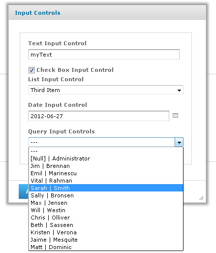
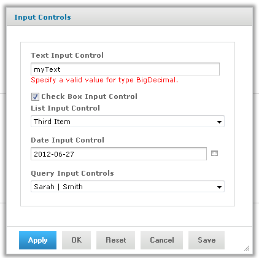
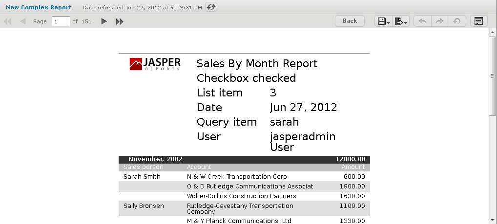

# Selecting a Data Source for Running the Complex Report

You need to select a data source to retrieve data for the report and the query input control, otherwise the report, and the list of users in the query input control remain blank.

To select a data source and run the complex report

1.  On the Controls & Resources page of the JasperReport wizard, select **Data Source**.

2.  On the Locate Data Source page, choose **Select data source from repository**.

3.  Click **Browse**, choose **Organization &gt; Data Sources &gt; JServerJNDI Data Source**, and lick **Select**.

4.  On Link a Data Source to the Report, click **Submit**.

5.  On the Locate Query Page, click **Submit** again to save the complex report. 
    Skip the Query and Customization pages of the JasperReport wizard to use the default settings on those pages. 
    The server validates the report and a message appears indicating that the report was added to the repository.

6.  In the Repository, click the name New Complex Report to run and view the report. 
    Input controls appear.

7.  Enter these input values, as shown in Figure 5‑22:

    -   Text Input Control: `myText`

    -   Checkbox Input Control: Check the checkbox.

    -   List Input Control: Select the **Third Item**.

    -   Date Input Control: Click  and select December 31, 2010.

    -   Query Input Control: Select **Sarah Smith** from the dropdown.

    

    *Figure 1 Input Controls Dialog for the New Complex Report*

8.  Click **OK** or **Apply** to run the report with the selected input, including the incorrect non-numerical input for the Text Input Control. 
    The server enforces the proper format defined for each input control. You defined the Text Input Control as a numeric type, so it accepts only valid numbers, as indicated by the message to specify a valid float number, as shown in Figure 5‑23.

    

    *Figure 2 Invalid Input Message*

9.  In Text Input Control, enter `3` and click **OK** or **Apply**. 
    The sample report includes a header that displays the value of each parameter received from the input controls. Values and labels appear in the language specified by the active resource bundle, in this case English.

*Figure 3 Output Controlled by Input*

In the Report Viewer, you can open the Input Controls dialog at any time by clicking the **Options** button. Click **OK** to run the report using the chosen values and close the Input Controls dialog. Click **Apply** to run the report using the chosen values, but keep the Input Controls open for choosing other values and rerunning the report.

!!! note

    If you get an error when you run the report, open it for editing as described in [Editing JRXML Report Units](repo-editing-jrxml.md). Review your settings. If you cannot find the problem, edit the SalesByMonth sample report (in the repository at /reports/samples) and compare its settings to your report.

To see the message written by the scriptlet JAR on the last page of the report, click  in the Report Viewer.
