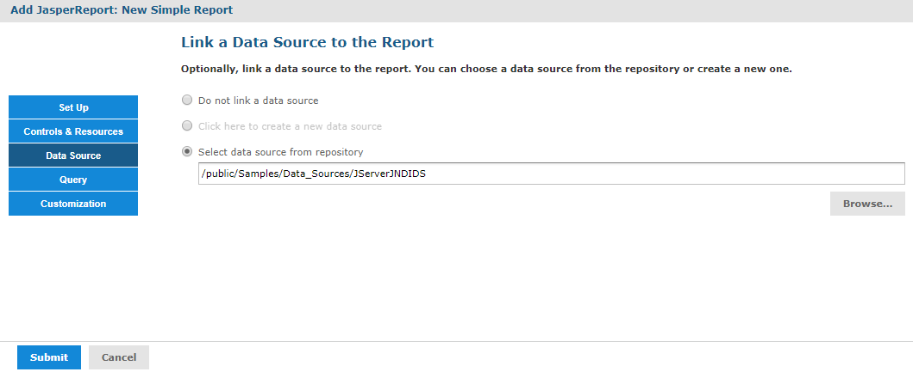

# Defining the Data Source

Data sources are not defined directly in the report JRXML file. It must be specified when you upload a file to JasperReports Server. On the data source page of the Add JasperReport wizard, you can select a data source in the repository or create a new data source.

If you want to create a data source, the application server must be able to find the driver for the database you want to use. For example, in a default installation of JasperReports Server, Tomcat looks for data source drivers in &lt;js‑install&gt;/apache-tomcat/lib. Put a copy of the driver in this location.

To define a data source for the simple report example

1.  In the JasperReports wizard, click **Data Source**. The Link a Data Source to the Report page presents these choices:

    -   Do not link a data source - Select or define the data source later. You see an error if you run the report in this state.
    -   Click here to create a new data source - Define a new data source available only to your report.
    -   Select data source from repository - Select an existing data source from the repository.

2.  Choose **Select data source from the Repository** and **Browse** to **Public &gt; Samples &gt; Data sources &gt; JServer JNDI Data Source**.

3.  Click **Select**. The Link a Data Source to the Report page reappears with the path to the data source.

    

    *Figure 1: Data Source Page*

4.  Click **Submit** to add the new report unit to the repository.
