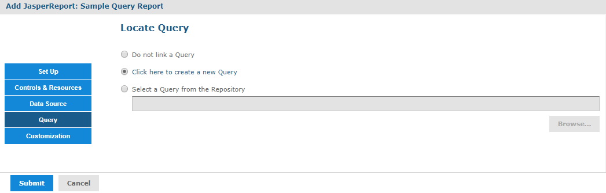
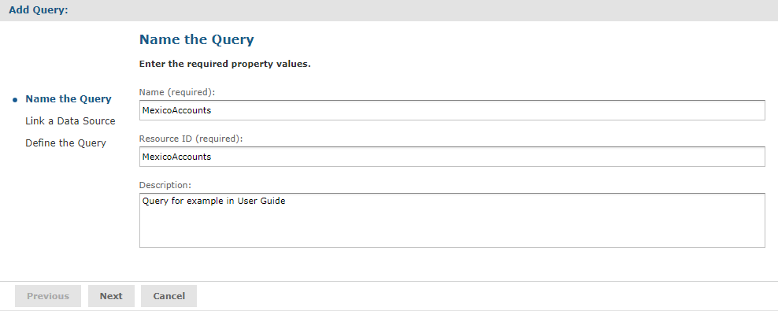
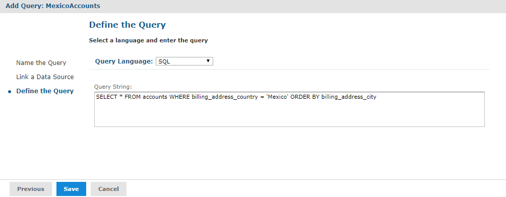
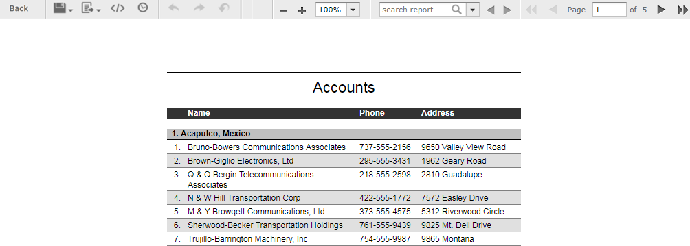

# Modifying the Query When Uploading a Report

The query in the report unit determines the data that the server retrieves from a data source. You can create multiple reports that look the same but contain different data by defining different queries for the same JRXML file each time you upload it. You can choose to use a stored query in the repository or define a new one. This example uses a query that returns accounts from a single country.

You can only override the main query for a report (specifically, the query defined directly within the JRXML root element `<jasperReport>`). If the report has elements that use a sub-dataset (including all table elements and all elements that use a different dataset), then the queries for these elements is not be affected.

First you need to upload the report and select a data source, as in the previous example. Then you can create a query that replaces the original query in the report.

To locate the sample report for this example

1.  Log in to the server as an administrator and select **View &gt; Repository**.

2.  Locate the folder where you want to add the report. For example, go to **Public &gt; Samples &gt; Reports**.

3.  Right-click the Reports folder and select **Add Resource &gt; JasperReport** from the context menu. The Set Up the Report page of the JasperReport wizard appears.

    !!! note

        **Add Resource** appears on the context menu only if you have write permission to the folder.

4.  In **Naming**, enter the name and description of the new report and accept the generated Resource ID:

    -   Name - Display the name of the report: `Sample Query Report`.
    -   Resource ID - Permanent designation of the report object in the repository: `Sample_Query_Report`.
    -   Description - Optional description displayed in the repository: `Example of changing a query in a report`.

5.  Select **Upload a Local File** and **Browse** to &lt;js-install&gt;/samples/reports/SimpleReport.jrxml.

6.  Click **Open** to upload the file.

To select a data source for the report

1.  In the Add JasperReport wizard, click **Data Source**. The Link a Data Source to the Report page appears.
2.  Choose **Select data source from the Repository** and **Browse** to **Public &gt; Samples &gt; Data sources &gt; JServer JNDI Data Source**.
3.  Click **Select**. The path to the data source appears on the page.

To define a custom query for the simple report example

1.  In the Add JasperReport wizard, click **Query**. The Locate Query page presents the following choices:

    -   **Do not link a Query** - Select this option to use the existing query already defined within the main JRXML.

    -   **Click here to create a new Query** - Guides you through defining a new query for this report only.

    -   **Select a Query from the Repository** - Select this option to use a saved query from the repository.

        !!! note

            The SimpleReport.jrxml file already contains a query. Choosing the second or third option overrides the existing query by defining a new one.

    

    *Figure 1: Query Page*

2.  Select **Click here to create a new Query**. The link becomes active.

3.  Click the link, **Click here to create a new Query**. The Add Query wizard appears and displays the Name the Query page.

4.  Enter the name, resource ID, and description of the query. The query in this example retrieves only Mexican accounts. Enter the following values:

    -   Name - `MexicoAccounts`
    -   Resource ID - `MexicoAccounts`
    -   Description - `Query for example in User Guide`

    This query and its properties are visible only within the report unit.

    

    *Figure 2: Name the Query Page*

5.  Click **Next**. The Link a Data Source to the Query page appears. Here you have the option to select a data source to use only with this query. This can be different from the data source you selected for uploading the report. You can choose an existing data source from the repository, define a new one, or select not to link a data source.

6.  Select **Do not link a data source** to use the same data source you already selected.

7.  Click **Next**. The Define the Query page appears.

8.  Select **SQL** in the Query Language dropdown and enter the following query string to retrieve only Mexican accounts:

    `SELECT * FROM accounts WHERE billing_address_country = 'Mexico' ORDER BY billing_address_city`

    

    *Figure 3: Definition of a Query*

9.  Click **Save** to save the query. The Customization page appears. No customization is required for the example.

10. Click **Submit** to submit the new report unit to the repository.

To run the report

Locate the report in the repository and click to run it. Only accounts in Mexico are shown in the report.

*Figure 4: Output of the Report*
