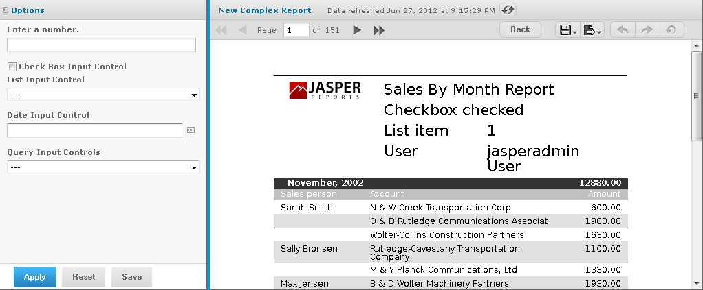

# Editing JRXML Report Units

After you add a report unit to the repository, you can edit any of its elements, including file resources and input controls. This example modifies the display text of the ambiguous Text Input Control.

To edit the complex report example

1.  Log into the server as an administrator and select **View \> Repository**

    !!! note

        If you log in as a user, you can edit a report that you created. This example requires an administrator login because an administrator created the complex report.

2.  Search or browse the repository to locate the report. In this example, go to **Organization \> Reports**.

3.  Right-click the New Complex Report and select **Edit** from the context menu. The JasperReport wizard opens the report unit.

4.  Navigate to the page of the wizard for making the change; in this example, click **Controls & Resources**.

5.  Make changes to an input control prompt and the display mode of the input controls, for example:
    1.  Click the name of the **TextInput** control. The Locate Input Control page shows that this input control is locally defined.
    2.  Click **Next**. The Create Input Control page appears.
    3.  Change the contents of the Prompt Text field to `Enter a number`. Click **Next**. The Locate Datatypes page appears. You can select a different datatype from the repository. For this example, accept the existing datatype setting.
    4.  In Locate Datatypes, click **Next**.
    5.  In Set the Datatype Kind and Properties, click **Save** to accept the datatype property settings.

6.  On the Controls & Resources page:
    1.  Change the Display Mode to **In Page**.
    2.  Clear the **Always prompt** check box.
    3.  Click **Submit**.

7.  Run the New Complex Report again. 
    Instead of appearing in a pop-up before the report, the input controls appear in the Filters panel of the report. In Figure 5‑25 you can see the new prompt **Enter a number** for the text input control. Because none of the input controls in this example are required, the report can display with blank input controls. Enter values and click **Apply** to modify the report output according to your input.

*Figure 1: Output of the Modified Report*
