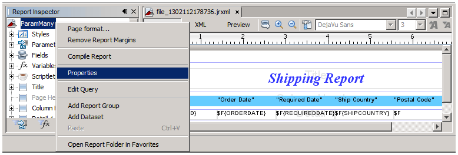
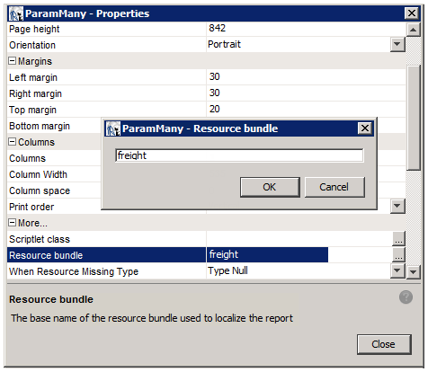
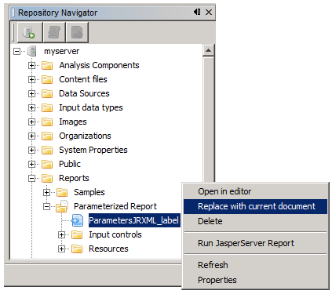
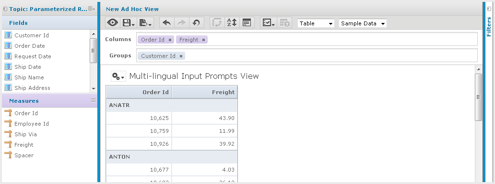
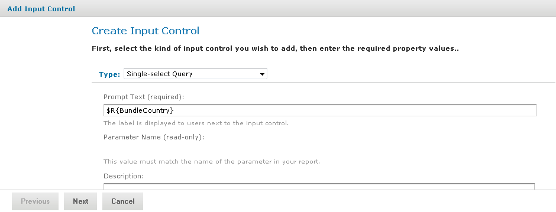
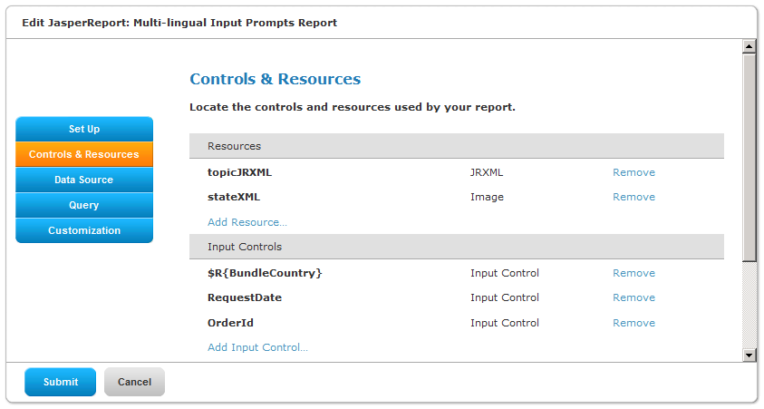
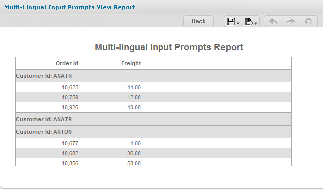
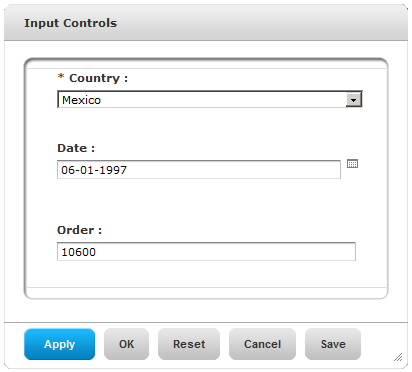
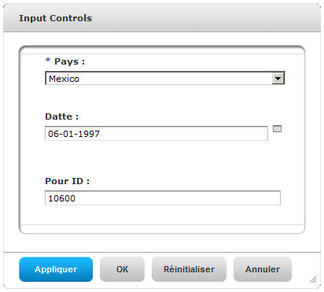

# Adding Multi-lingual Prompts to Input Controls

This section describes how to create an Ad Hoc report that prompts for input in multiple languages. The tasks are:

-   Set the base name of the resource bundles in the JRXML Topic.

-   Create resource bundles that contain translations for the prompts.

-   Create an Ad Hoc report based on the JRXML Topic.

-   Edit an input control to make prompts multi-lingual.

-   Upload the resource bundles.

-   Run the report and use the localized input control.

    The order of these tasks is important: Set the base name of the resource bundle in the JRXML Topic first, then create the Ad Hoc report. If you open the JRXML Topic after creating an Ad Hoc report, Jaspersoft Studio removes grouping or sorting of data if there is any.

    To set the base name of the resource bundles in the JRXML Topic

    1.  Start Jaspersoft Studio. In Jaspersoft Studio, click **Window &gt;JasperReports Server Repository**. The Repository Navigator appears. This is where you set up a connection to the server.

    2.  Navigate to **Ad Hoc Components &gt; Topics** and right-click the JRXML topic for this report: **Parametrized Report**.

    3.  Select **Copy**.

    4.  Navigate to the **Reports** folder, right-click and select **Paste**. The Parametrized Report topic appears in Reports.

    5.  To open the topic in the Designer tab, expand the Parametrized Report folder and double-click its main JRXML: **ParametersJRXML_label**. The Shipping Report appears in the Designer tab.

    6.  Click **Window &gt; Report Inspector**.

    7.  In the Report Inspector, right-click the root node: **ParamMany** and choose **Properties**. In the main JRXML, ParamMany is the report name.

        In Figure 5‑27, you can see the ParamMany root node and Properties context menu.

        

        *Figure 1: Selecting Properties of the ParamMany report*

    8.  In the ParamMany Properties dialog, set the base name of the resource bundle to freight:

        1.  Scroll down to the **Resource bundle** property.

        2.  Click .

        3.  Enter `freight` and click **OK** .

            In Figure 5‑28, you can see the properties of the ParamMany report.

            

            *Figure 2: Setting the Base Name of the Resource Bundle*

    9.  Click **Close**.

    10. Click **File &gt; Save** to save the resource bundle name to the JRXML.

    11. In the Repository Navigator, right-click **ParametersJRXML_label** and choose **Replace with Current Document**.

    

    *Figure 3: Saving the Current Document in iReport to the Repository*

    The modified JRXML with a base resource bundle name overwrites the Parametrized Report Topic in the repository.

    To create resource bundles that contain translations for prompts

    1.  In a text editor, create a new file for English translations.

    2.  Enter these name-value pairs in the file:

        <table>
        <colgroup>
        <col style="width: 100%" />
        </colgroup>
        <tbody>
        <tr>
        <td>
<pre><code>BundleCountry = Country
        BundleDate = Date
        BundleOrder= Order</code></pre>
</td>
        </tr>
        </tbody>
        </table>

    3.  Save the file as `freight.properties`.

        !!! note

            The file name of the default (English) resource bundle consists of the base name of the resource bundle and the properties extension.

    4.  In a text editor, create a new file for French translations and enter these name-value pairs in the file:

        <table>
        <colgroup>
        <col style="width: 100%" />
        </colgroup>
        <tbody>
        <tr>
        <td>
<pre><code>BundleCountry = Pays
        BundleDate = Date
        BundleOrder = Pour ID</code></pre>
</td>
        </tr>
        </tbody>
        </table>

    5.  Save the file as `freight_fr.properties`.

    !!! note

        The file name of a localized resource bundle follows this Java naming convention:

        &lt;default_file_name&gt;\_&lt;locale&gt;.properties

        -   &lt;default_file_name&gt; is the base name of the resource bundle
        -   &lt;locale&gt; is a Java-compliant locale identifier

    To create an Ad Hoc View based on the JRXML Topic

    1.  Log into the server as administrator, and choose **Create &gt; Ad Hoc View**.
    2.  In the Select Data wizard, click  and navigate to **Ad Hoc Components &gt; Topics** and choose **Parametrized Report**.
    3.  Click **Table.** The Parametrized Report topic (a blank report) opens in the Ad Hoc Editor.
    4.  In the **Measures** list, double-click these fields:

    -   Order ID

    -   Freight

        1.  In the **Fields** list, right-click **Customer Id** and select **Add as Group**.

        2.  Click **Click to add a title** and enter **Multi-lingual Input Prompts View.**

            

            *Figure 4: Creating an Ad Hoc View*

        3.  Click  and select **Save Ad Hoc view As and Create Report**. In the Save As dialog, select the **Ad Hoc Reports** folder, and enter:

    -   Data View Name: `Multi-lingual Input Prompts View`

    -   Data View Description: `A report that prompts for input in French and English.`

    -   Report Name: `Multi-lingual Input Prompts View Report`

        1.  Browse to a location to save both the view and report.
        2.  Click **Default Report Template**.
        3.  Click **Save**.

        To edit an input control to make prompts multi-lingual

        1.  In the server, click **View &gt; Repository.**
        2.  Locate the Multi-lingual Input Prompts View Report, right-click it, and choose **Edit**. The JasperReport wizard appears.
        3.  Click **Controls & Resources**. The Controls & Resources page lists these input controls:

    -   Country

    -   RequestDate

    -   OrderID

        1.  Click the **Country** input control.

        2.  On the Locate Input Control page, click **Next** to define an input control in the next step.

        3.  On the Create Input Control page, change the prompt text from `Country` to this expression:

            `$R{BundleCountry}`

            In Figure 5‑31 this expression is entered in the prompt text field.

            

            *Figure 5: Entering a $R Expression in the Prompt Text Field*

        4.  Click **Next**.

        5.  Accept the default settings on subsequent pages by clicking **Next** and **Save:**

            1.  On the Locate Query page, click **Next**.
            2.  On the Name the Query page, click **Next**.
            3.  On the Link a Data Source to the Query page, click **Next**.
            4.  On the Define the Query page, click **Save**.

        6.  On the Set Parameter Values page, click **Submit**.

            The Controls & Resources page now shows the `$R{BundleCountry}` expression instead of Country at the top of the list of input controls.

            

            *Figure 6: Input Controls Include One Multi-lingual Input Control*

        7.  Change the prompt text of the other input controls in a similar manner:

            1.  Repeat step 4 through step 6 to change the RequestDate and OrderID input controls to these expressions:

                RequestDate: `$R{BundleDate}`

                OrderID: `$R{BundleOrder}`

            2.  Accept the default settings on subsequent pages of the JasperReport wizard by clicking **Next** and **Save**. The Controls & Resources page now shows the `$R` expressions for all three input controls.

        To upload the resource bundles

        1.  On the **Controls & Resources** page, click **Add Resource**. The Locate File Resource page appears.

        2.  Select **Upload a Local File.**

        3.  **Browse** to the freight.properties file, and click **Open**.

        4.  On the Locate File Resource page, click **Next**.

            On the Add a Report Resource page, freight.properties appears as the Selected Resource, indicating that the server automatically detected it as a resource bundle.

        5.  On the Add a Report Resource page, enter these properties:

    -   Name – `freight.properties`

    -   Resource ID – `freight.properties`

    -   Description – `Default English resource bundle`

        1.  Click **Next**. The list of resources on the Controls & Resources page now includes the resource bundle freight.properties.

        2.  On Controls & Resources, click **Add Resource** again, but this time upload the French resource bundle:

            1.  On the Controls & Resources page, click **Add Resource** again.
            2.  Select **Upload a Local File**, **Browse** to the freight_fr.properties file you created, and click **Open**.
            3.  In Locate File Resource click **Next**. The **Add a Report Resource** page appears.
            4.  Enter the following information:

        -   Name – `freight_fr.properties`
        -   Resource ID – `freight_fr.properties`
        -   Description – `French resource bundle`

1.  Click **Next**. The Controls & Resources page shows the English and French resource bundles in the resources list.
2.  Click **Submit**.

To run the report and use the localized input control

1.  Click **Log Out**.

2.  On the Login page click **Show locale & time zone**.

3.  Select the **en_US-English (United States)** locale and log into the server as an administrator.

4.  Run the Multi-lingual Input Prompts Report. The report appears in the Report Viewer.

    

    *Figure 7: Viewing the Report in English*

5.  Click **Options**.

    The input controls appear with English prompts.

6.  Click **Log Out**.

7.  On the Login page, click **Show locale & time zone**.

8.  Select the **fr - French** locale, and log in as administrator.

9.  Run the report again and click Options.

In Figure 5‑34, you can see the input controls that with English and French prompts.

     

*Figure 8: Input Control Prompts in English and French*
