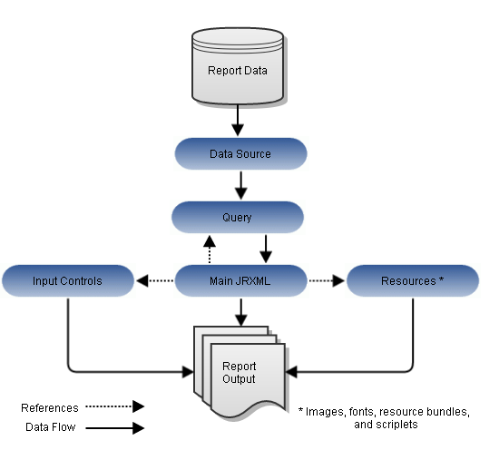

# Overview of a Report Unit

In the server, a report unit is the collection of elements used for retrieving data and formatting output. The Anatomy of a Report Unit shows these elements:

- The data source and the query that retrieves data for the report.
- The main JRXML that determines the layout and is the core of the report unit.
- The main JRXML defines other elements in one of the following ways:
  - Creating definitions internally
  - Referring to existing elements in the repository using the `repo:` syntax
- The input controls and other resources.

For more information about the report unit, refer to the JasperReports Server Ultimate Guide.

*Figure 1: Anatomy of a Report Unit*
