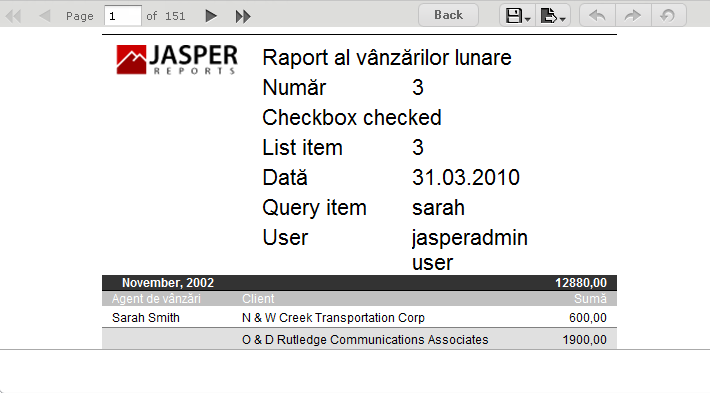

# Running a Localized Report

In this procedure, you run the Romanian version of the complex report that you added in [Uploading Undetected File Resources](repo-undetected-file-resources.md).

To run the Romanian version of the complex report

1.  Choose the Romanian locale on the login page of the server, and login as an administrator.

2.  Click **View &gt; Repository**, and navigate to **Organization &gt; Reports**.

3.  Click the name of the complex report, New Complex Report. The Input Controls dialog appears.

4.  Enter input control values:

    1.  Text Input Control: `3`

    2.  Check Box Input Control: Check the check box.

    3.  List Input Control: Select **Third Item**.

    4.  Date Input Control: Click  and select March 31, 2010.

    5.  Query Input Control: Select **Sarah Smith** from the drop-down.

    6.  Click **OK**.<br>
        The fields in the title band and column names (sales person, sales account, and sales amount), shown in Figure 1-1, appear in the language set by the Romanian resource bundle sales_ro.properties:

        ``` properties
        title=Raport al v\u00E2nz\u0103rilor lunare
        sales.person=Agent de v\u00E2nz\u0103ri
        sales.account=Client
        sales.amount=Sum\u0103
        param.number=Num\u0103r
        param.date=Dat\u0103
        ```

The currency and dates in the report output header map to Romanian locale settings.



*Figure 1 A Report Localized for the Romanian Locale*

By default, the web interface elements appear in US English when you choose an unsupported locale, such as the Romanian locale. If you choose a supported language, the web interface elements appear in that language. Supported languages are Chinese (Simplified), French, German, Japanese, and Spanish. You can customize the server to support additional languages. You can translate the web interface into a different language, server property names, and messages in another language. For some locales, you may also need to change the default locale and time zone. For more information about localizing the server, see the JasperReports Server Administrator Guide.
