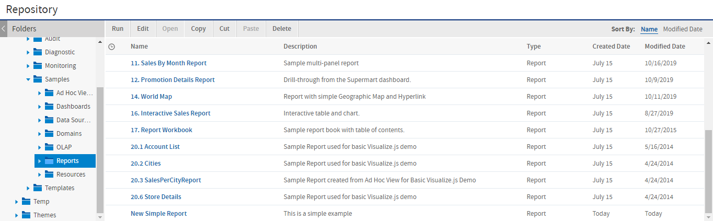
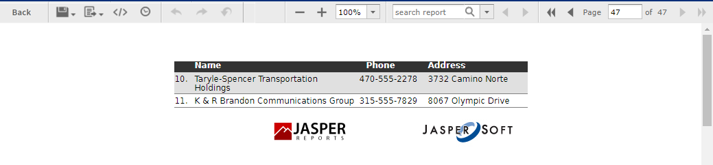

# Saving the New Report Unit

To submit a new report unit to the repository, click **Submit** on any page of the JasperReport wizard, from the Set Up page to the Customization page. You do not have to set options, which are not needed, such as Customization. When you click **Submit**, the server attempts to upload the JRXML report and its resources. If the upload is successful, a message appears at the top of the repository page, indicating that the report was saved. The report appears in the repository with the description that you entered on the Set Up page. To run the report and view the output, click its name, New Simple Report.

*Figure 1 New Report Added to the Repository*

In the report viewer, click  to go to the end of the report, where the logo images that you added appear. The following figure shows the output.

*Figure 2 Output of the New Simple Report*
