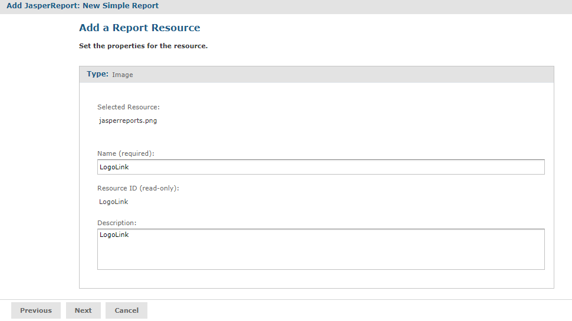

# Uploading Suggested File Resources

If needed files are missing, as shown in [Suggested Resources in the Resources List](repo-add-simple-report-unit.md), you need to take one of the following actions:

-   Upload resources that the report needs

-   Select a resource from the repository

    !!! note

        If the Controls & Resources page doesn’t suggest resources, perhaps the report doesn’t reference any. However, the server can’t always detect all the referenced resources, as discussed in [Uploading Undetected File Resources](repo-undetected-file-resources.md).

To upload a resource from the file system

1.  On the Controls & Resources page, click **Add Now** in the row of the missing resource, for example, LogoLink. The Locate File Resource page appears.

2.  Choose **Upload a Local File** then click **Choose File**.

3.  **Browse** to &lt;js-install&gt;/samples/images. The LogoLink file is not available, but you can use an alternate image, such as &lt;js-install&gt;/samples/images/jasperreports.png.

4.  Click **Open** to return to the Locate File Resource dialog.

5.  Click **Next**. The Add a Report Resource page appears. 

    

    *Figure 1: Properties of a Resource*

    !!! note

        The properties include the LogoLink name, resource ID, and description.

6.  Click **Next** to accept the default naming of the file resource.

The Controls & Resources page appears again, showing that the LogoLink resource was added.

To add a resource from the repository

1.  To add the second resource, click **Add Now** in the row for AllAccounts_Res2.

2.  Choose **Select a resource from the Repository** and **Browse** to an image file, for example, **Public &gt; Samples &gt; Images &gt; Jaspersoft_logo.png**.

    !!! note

        Any image file works.

3.  Click **Select**. 
    The path to the image appears in the wizard.

4.  Click **Next**. The Add a Report Resource page displays the properties of the image as set in the uploaded JRXML file.

    !!! note

        The properties include the LogoLink name, resource ID, and description. These properties don’t redefine the properties of the Jaspersoft_logo.png file in the repository.

5.  Click **Next** to accept the default naming of the file resource. 
    The Controls & Resources page reappears, showing the addition of both resources referenced in the main JRXML.

6.  Click **Data Source** and define a data source as described in the next section.
