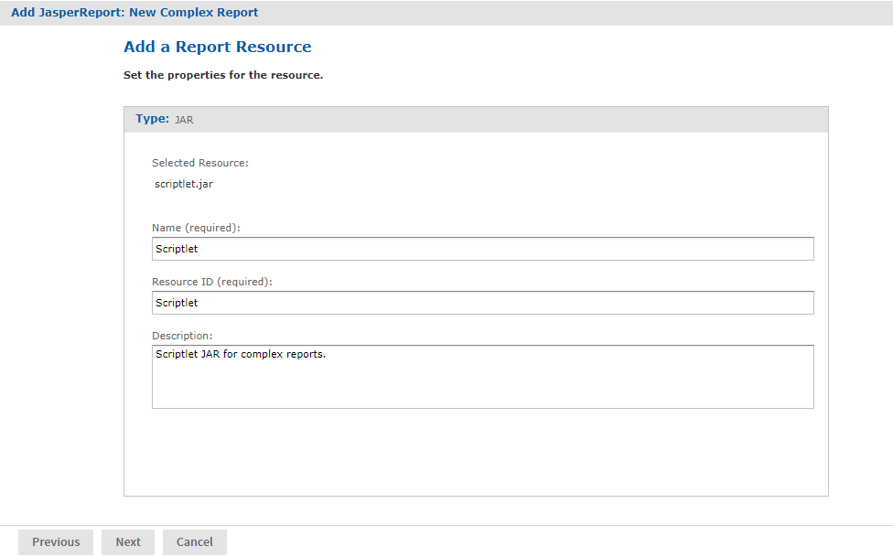
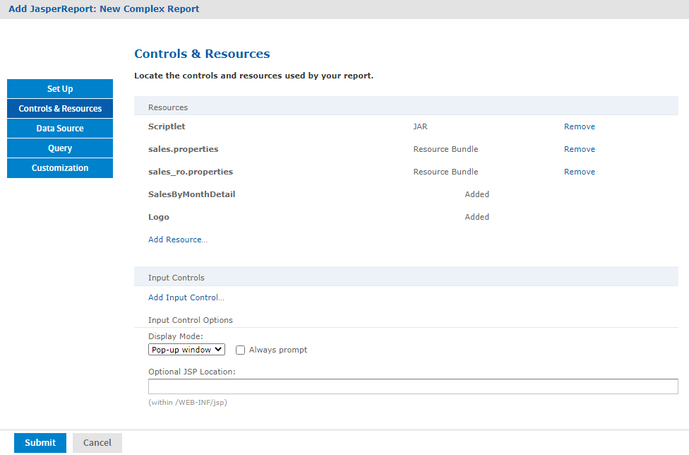

# Uploading Undetected File Resources

The JasperReport wizard cannot detect every type of resource referenced in the main JRXML. You need to add the undetected resources before the server can upload the report. For the following example, we provide the names of these resources. To discover undetected resources, open the JRXML in Jaspersoft Studio and examine its parameters and properties. For more information about the JasperReports Server Plug-in, see the Jaspersoft Studio User Guide.

These are the undetected resources in the SalesByMonth.jrxml:

-   A scriptlet JAR - The scriptlet writes the message, “I’m a scriptlet in a jar”, to the last page of the report output.
-   An English language resource bundle.
-   The optional Romanian language resource bundle.

If you are interested in working with a multi-lingual report, add the Romanian resource bundle. The Romanian resource bundle is part of the sample data installed with the server.

On the Controls & Resources page, upload the undetected resources to the server using the same name Jaspersoft Studio uses for the resource ID.

To upload the undetected file resources for the complex report example

1.  Add and upload the scriptlet JAR file:

    1.  On the Controls & Resources page, click **Add Resource**.

    2.  On the Locate File Resource page, select **Upload a Local File**, and **Browse** to the &lt;js-install&gt;/samples/jars/scriptlet.jar file. Select scriptlet.jar. 
        The path to the file appears in the **Upload a Local file** field.

    3.  Click **Next**. 
        The Add a Report Resource page appears. Figure 1 shows the file name scriptlet.jar, indicating that the server successfully loaded and automatically detected the JAR.

    4.  Enter the following information:

        -   Name – `Scriptlet`
        -   Resource ID – `Scriptlet`. The Resource ID is referenced in the main JRXML file, so do not change it.
        -   Description – `Scriptlet JAR for complex report`

    The following figure shows these values entered on the Add a Report Resource page.

    

    *Figure 1: Scriptlet JAR Resource Properties*

2.  Click **Next**.

3.  Add and upload the English resource bundle:

    1.  On the **Controls & Resources** page, click **Add Resource**. The Locate File Resource page appears.

    2.  Select **Upload a Local File**, **Browse** to &lt;js-install&gt;/samples/resource_bundles/sales.properties, and select it. The path to the resource bundle appears in the **Upload a Local file** field.

    3.  In Locate File Resource, click **Next**. The **Add a Report Resource** page indicates that the file was successfully loaded and automatically detected as a resource bundle.

    4.  Enter the following information:

        -   Name – sales.properties

        -   Resource ID – sales.properties

        -   Description – Default English resource bundle

4.  Click **Next**.

5.  Add and upload the Romanian Resource bundle:

    1.  On the Controls & Resources page, click **Add Resource**.

    2.  Select **Upload a Local File**, **Browse** to the file &lt;js-install&gt;/samples/resource_bundles/sales_ro.properties, and select it.

    3.  In Locate File Resource, click **Next**. The Add a Report Resource page shows that uploading the file was successful. The server recognized the type (resource bundle) and name (sales_ro.properties) of the selected resource.

    4.  Enter the following information:

        -   Name – `sales_ro.properties`
        -   Resource ID – `sales_ro.properties`
        -   Description – `Romanian resource bundle`

    5.  Click **Next**. Controls & Resources lists all the files.

*Figure 2: List of Detected and Undetected File Resources*

If you want to upload a different file for a named resource, click its resource ID in the **Resources** list and locate the new file or repository object. You can change the name and description of the resource, but not its resource ID. If there is a mistake in a resource ID:

-   Locate the ID in the list of resources on the Controls & Resources page, and click **Remove**.
-   Re-add the resource, entering the correct resource ID.
