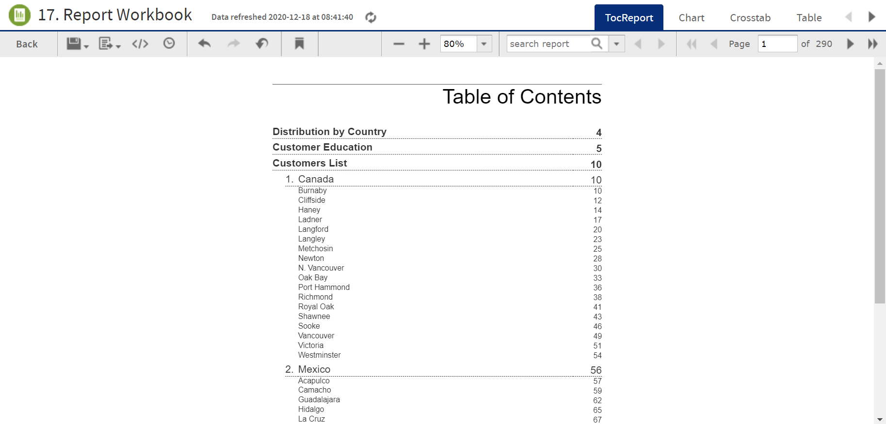

# Running a Report Book

Report books are multiple reports bundled into a single object, created in Jaspersoft Studio. You can run and view report books from the Library page or the repository, much like you would a standard report. However, report books contain some elements that are not found in standard reports.

To run a report book in the Report Viewer

1.  In the repository, click the name of the report book you want to run. For example, click the sample **17. Report Workbook**. The report appears, as shown below.  

    

    *Figure 1 Sample report book as seen in the Report Viewer*

     The sample report book contains three bundled reports:

    -   **Distribution by Country**, a chart-type report.

    -   **Customer Education**, a crosstab-type report.

    -   **Customers List**, a table-type report.

        Each of these reports can be accessed by a tab, along with the Table of Contents page, located at the top of the Report Viewer.

2.  Click the **Chart** tab to open the **Customer Distribution by Country** report. Note that you can interact with this report as you would with a standard chart-based report in the viewer.

3.  Click the **TocReport** tab to return to the table of contents page.

4.  Scroll down and click the **Acapulco** entry in the table of contents. The first page of the Acapulco table entries is displayed.

5.  Click  to open the bookmarks pane.

6.  Click the **Customer Education** entry in the bookmarks pane. The Customer Education crosstab report opens in the viewer.

7.  Close the bookmarks pane by clicking the x in the upper right corner of the pane.
