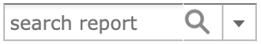
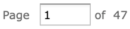

# Report Viewer Tool Bar

The Report Viewer tool bar contains a number of controls for working with your report. These controls are described in Table 1-1.

<table>
<caption>
Report Viewer Tool Bar Icons
</caption>
<colgroup>
<col style="width: 33%" />
<col style="width: 33%" />
<col style="width: 33%" />
</colgroup>
<thead>
<tr>
<th>
Icon
</th>
<th>
Name
</th>
<th>
Description
</th>
</tr>
</thead>
<tbody>
<tr>
<td> or </td>
<td>View Alert List</td>
<td>
Click to open a panel that contains the list of alerts.

When there are no alerts, this icon is a plain bell.

When there are one or more alerts, the bell icon has a dot.
</td>
</tr>
<tr>
<td>

</td>
<td>
Refresh report with latest data
</td>
<td>
Click to refresh the report data from the data source.
</td>
</tr>
<tr>
<td>

</td>
<td>
Close Report
</td>
<td>
Exits the Report Viewer and takes you to the previous screen.
</td>
</tr>
<tr>
<td>

</td>
<td>
Save
</td>
<td>
Place the cursor over this icon to open a menu of save options.
</td>
</tr>
<tr>
<td>

</td>
<td>
Export
</td>
<td>
Click to export the View into one of the available formats.
</td>
</tr>
<tr>
<td></td>
<td>Get embed code</td>
<td>
Click to display the Report Embed Code Panel. For more information, see <a href="reports-get-embed-code.md">Getting the Embed Code for Visualizations</a>.
</td>
</tr>
<tr>
<td></td>
<td>Schedule report</td>
<td>Click to display the New Schedule dialog. For more information, see <a href="reports-scheduling.md">Scheduling a Report</a>.</td>
</tr>
<tr>
<td>

</td>
<td>
Undo
</td>
<td>
Click to undo the most recent action.
</td>
</tr>
<tr>
<td>

</td>
<td>
Redo
</td>
<td>
Click to redo the most recently undone action.
</td>
</tr>
<tr>
<td>

</td>
<td>
Undo All
</td>
<td>
Click to revert the report to its most recently saved state.
</td>
</tr>
<tr>
<td></td>
<td>
Turn on alert mode

or

Turn off alert mode
</td>
<td>Click to turn on or turn off the alert mode.</td>
</tr>
<tr>
<td>

</td>
<td>
Input Controls
</td>
<td>
Click to see the input controls applied to this report. For more information, see <a href="reports-simple-input-controls.md">Simple Input Controls</a>.
</td>
</tr>
<tr>
<td>

</td>
<td>
Zoom Out
</td>
<td>
Click to zoom out on the report.
</td>
</tr>
<tr>
<td>

</td>
<td>
Zoom In
</td>
<td>
Click to zoom in on the report.
</td>
</tr>
<tr>
<td>

</td>
<td>
Zoom Options
</td>
<td>
Click this icon to open the Zoom Options dropdown menu.
</td>
</tr>
<tr>
<td>

</td>
<td>
Search
</td>
<td>
Enter your search term here to find a text string in your report. Click the dropdown menu to toggle search preference settings.
</td>
</tr>
<tr>
<td>

</td>
<td>
First
</td>
<td>
Click to jump to the first page of the report.
</td>
</tr>
<tr>
<td>

</td>
<td>
Previous
</td>
<td>
Click to go to the previous page in the report.
</td>
</tr>
<tr>
<td>

</td>
<td>
Next
</td>
<td>
Click to go to the next page in the report.
</td>
</tr>
<tr>
<td>

</td>
<td>
Current Page
</td>
<td>
Shows the number of the currently displayed report page.
</td>
</tr>
<tr>
<td>

</td>
<td>
Last
</td>
<td>
Click to jump to the last page of the report.
</td>
</tr>
<tr>
<td>

</td>
<td>Bookmarks</td>
<td>
Click to display the Table of Contents pane. This pane is available only on reports with enabled Bookmarks.
</td>
</tr>
<tr>
<td></td>
<td>Print</td>
<td>Click the Print icon to print the report. The title bar displays the message <strong>Opening printer</strong> and the print dialog opens, then click <strong>Print</strong>.</td>
</tr>
</tbody>
</table>
