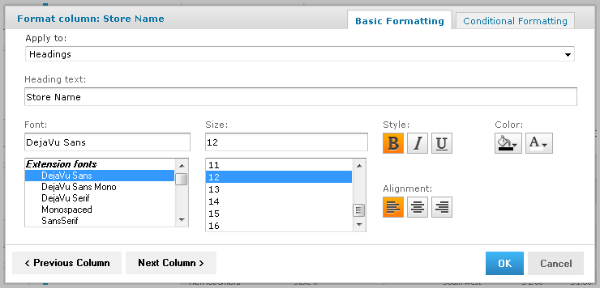

# Column Formatting

You can customize the basic formatting of column headings and fields, using the Format Column dialog. Hover over and click **Formatting...** The Format column dialog appears.

*Figure 1: Format Column Dialog*

You can alter a column’s basic formatting or apply conditional formatting to a column.

!!! note

    In longer reports, columns have floating headers. If your report extends past your browser frame, use the vertical scroll bar to move up and down the list. If you do not see a vertical scroll bar, try increasing the width of your browser window.

This section discusses how to apply formatting to column headings and values. For information on conditional formatting, see [Conditional Formatting](reports-conditional-formatting.md).

Column formatting options include:

- Text

- Font type, size, and style

- Background color

- Font color

- Text alignment

To customize your column formatting

1.  Run your report, so it opens in the Report Viewer.
2.  Click the column that you want to format.
3.  Hover over and click **Formatting**.
4.  Click the **Basic Formatting** tab, and change the following options if needed:
    - **Apply to** - Select the part of the column you want to apply the formatting to.
    - **Heading text** - Type a new heading text to replace the current text.
    - **Font** – Scroll through the menu to select a font.
    - **Size** - Scroll through the menu to select a font size.
    - **Style** - Click to select Bold, Italic, or Underlined text.
    - **Background Color** - Click to open the background color picker, then click to select the background color.
    - **Font Color** - Click to open the font color picker, then click to select the text color.
    - **Alignment** - Click to select the Left, Center, or Right alignment.
5.  If needed, click **Previous Column** or **Next Column** to change the formatting for an adjacent column.
6.  Click **OK**.
