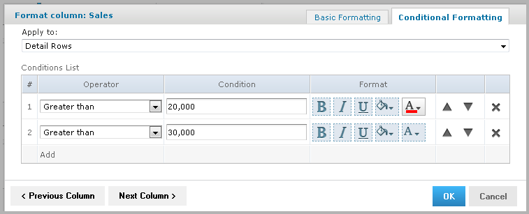
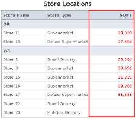
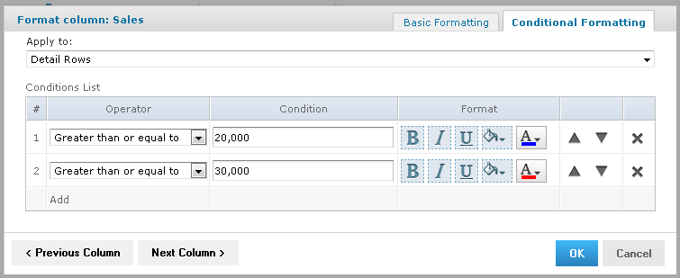
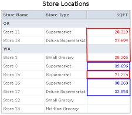
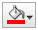
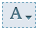
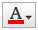
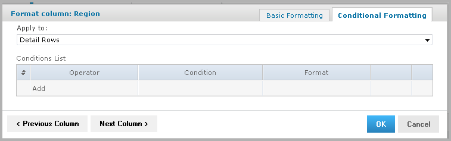

# Conditional Formatting

The Report Viewer allows you to format column headings and fields, to highlight data that meets specific criteria. For instance, if you want to call out fields for store sales above $100,000, you can do so by applying text and background formatting to those stores that meet those numbers.

With conditional formatting, you can apply the formatting options listed in [Column Formatting](reports-column-formatting.md). However, it is a slightly more complex process than applying formatting options to entire columns. This section describes those complexities, including:

-   Condition hierarchy

-   Condition button states

-   Applying conditional formatting

## Condition Hierarchy

If you have multiple conditions applied to a single field, then their order affects how they function. Conditions are read and applied from bottom to top, and the topmost condition overrides the ones below.

For example, imagine you have more than one condition applied to the same format element: red text for all stores over 20,000 square feet, and blue text for all stores over 30,000 square feet. As shown in Figure 3‑4, “Condition Hierarchy Example,” on page 39, placing the formatting rule for stores over 20,000 above the rule for stores over 30,000 causes the topmost rule to override the one below:

<table>
<tbody>
<tr>
<th colspan="2">
Hierarchy
</th>
<th>
Result
</th>
</tr>
&#10;<tr>
<td colspan="2">

</td>
<td>

</td>
</tr>
<tr>
<td colspan="2">

</td>
<td>

</td>
</tr>
</tbody><tfoot>
<tr>
<td colspan="3">
<em>Figure 1 Condition Hierarchy Example</em>
</td>
</tr>
</tfoot>
&#10;</table>

## Condition Button States

Because conditions higher up in the hierarchy can affect those below, the font style selection buttons each have three states:

-   **Unchanged**, which means it inherits the previous condition-based style, if any.

-   **Set**, which means the style is applied to the text that meets the condition.

-   **Not Set**, which means the style is not applied to the text that meets the condition, and is removed if a conflicting condition lower in the conditional formatting hierarchy has marked that style as “Set”.

By default, the buttons are in the “Unchanged” state. Clicking the buttons toggles you through the three states.

See “Style Button States” for examples of the style button states.

**Style Button States**

|  | Unchanged | Set | Not Set |
|----|----|----|----|
| Bold |  |  |  |
| Italic |  |  |  |
| Underline |  |  |  |

The background and font color pickers have buttons for similar states, but these states behave slightly different:

-   **Unchanged**, which means the field inherits the previous condition-based color, if any.

-   **Set**, which means the color is applied to the text or background of the field that meets the condition.

-   **No Fill (background only)**, which means no color is applied to the background that meets the condition. Regardless of conditions lower in the hierarchy, the background inherits the table’s default color.

Both have two buttons at the top of the window, along with the color selection boxes.

You control these states through the background color picker and the font color picker windows, using the following buttons:

-   **No Fill (background only)**, which applies to the No Fill state described above.

-   **Reset**, which returns the text or background to the Unchanged state.

-   The **color selection boxes**, which apply to the Set state.

See Table 3‑4, “Color Picker Button States,” for examples of the color picker button states.

**Color Picker Button States**

|  | Unchanged | Set | No Fill |
|----|----|----|----|
| Background Color |  |  |  |
| Text Color |  |  | N/A |

## Applying Conditional Formatting

You apply conditional formatting much like you do standard column formatting, as described in [Column Formatting](reports-column-formatting.md) with the extra step of creating the condition by which the formatting is applied.

To create a condition

1.  Run your report, so it opens in the Report Viewer.

2.  Click the header or field of the column that you want to format.

3.  Move your mouse over and click **Formatting**.

4.  Click the **Conditional Formatting** tab. The Conditional Formatting options appear:

    

    *Figure 2 Conditional Formatting Tab*

5.  In the **Apply to** box, select the part of the column you want to apply the formatting to.

6.  Click **Add**. This adds a line item in the Conditions List.

7.  Fill in the following information:

    -   **Operator**: Use the dropdown menu to define how the condition is compared to the column data.
    -   **Condition**: Enter the condition criteria.
    -   **Format**: Select the formatting applied to fields meeting the defined condition. Take care while setting the button states, as described in [Condition Button States](#condition-button-states).

8.  Repeat if needed to add multiple conditions to a column. 
    If you have multiple conditions, you may want to reorder them, to ensure they do not conflict with each other. Use the  and  to move conditions in the hierarchy.

9.  If needed, click **Previous Column** or **Next Column** to change the conditional formatting for an adjacent column.

10. Click **OK**. The condition is applied to the column.
