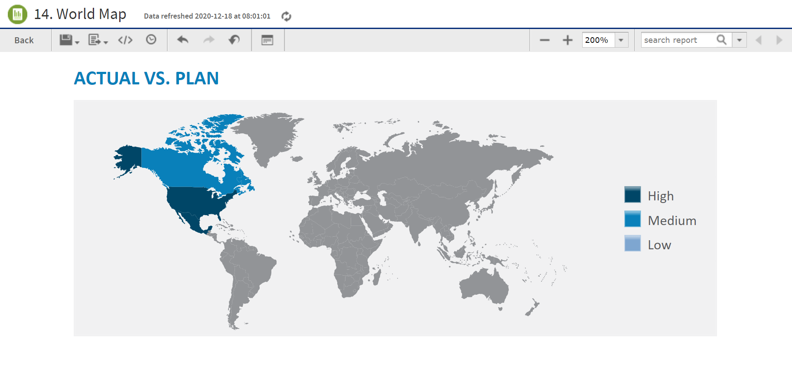

# Running a Fusion Chart

The JasperReports Server commercial editions support Fusion charting, and include the Maps Pro, Charts Pro, and Widgets Pro component libraries.

Using the libraries, you can create visually appealing, animated, and interactive reports:

- Maps Pro - Color-coded maps covering all countries and regions of the globe.

- Charts Pro - Standard and stacked charts with animation and interactivity.

- Widgets Pro - Non-standard charts such as gauges, funnels, spark lines, and Gantt charts.

These components are based on Fusion libraries, which generate HTML5 output that is embedded in the HTML and PDF output. When a report containing a Maps, Charts, or Widgets Pro element is exported in a format other than HTML or PDF, the space used by the element remains blank.

Flash is no longer recommended.

For information on configuration, see the JasperReports Server Administrator Guide.

Fusion charts are created in Jaspersoft Studio Professional as JRXML reports and uploaded to the repository as a report unit.

To find and run a chart example

1.  In the repository, locate the sample report **14. World Map**.

2.  Click the report name to run the report.

3.  In the **Input Controls** window, select **Food** as the product family that you want to view sales trends for and then click **OK**. The report appears, as shown in “World Map Report with Flash Map”.

    

    *Figure 1: World Map Report with Flash Map*

4.  To interact with the map, mouse-over any of the countries to see the full country name and, when it has data, the value for that country.

5.  On the map, click **Canada** to launch the Interactive Sales Report, displaying the information for Canada only. From there, you can modify the underlying report as needed.

To upload JRXML reports, see [Adding Reports Directly to the Repository](../repo-upload-reports/repo-reports-adding.md).

# HTML Pro Component

JasperReports Server supports a report with HTML component in it. The HTML Pro component allows embedding HTML content (including layout tables, and images) into JasperReports. The basic HTML formatting using HTML as the markup language for text fields is available, but it is limited and does not support images, tables, and custom CSS-based formatting.

The component fetches HTML content provided by an expression (`contentExpression`), which can either be a string containing HTML code or a URL. The component's output can span several pages. It modifies the HTML content to prevent text from splitting between pages, similar to how browsers handle document printing. However, any CSS directives with `media="print"` are ignored.

The component uses an `<iframe>` and CSS to present only the relevant portion of the HTML content on each page. Currently, each `<iframe>` contains the entire HTML document and shows only the relevant portion by setting the document's top margin, hiding the overflow, and preventing scrolling.

The user perceives only the chunk of the HTML document reserved for that page. Since the HTML is provided by the user and not generated by JasperReports, links are undetected by JasperReports and unavailable in the report metadata, even if the user wants to use them in advanced modes like Visualize.js.

To enable HTML support in JasperReports Server, the `<iframe>` HTML tag should be removed from the XSS escaping security feature of JasperReports Server by adding a `+iframe` token to the `xss.soft.html.escape.tag.whitelist` property in the `[JRS]/WEB-INF/classes/esapi/security-config.properties` file.

For more information on the HTML Pro component, see the Jaspersoft Studio User Guide.
