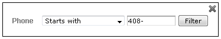
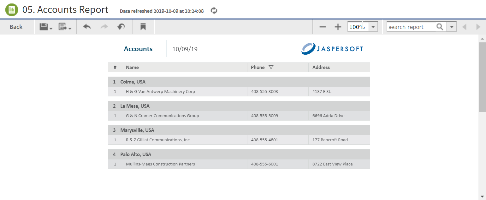

# Interactively Filtering Report Output

If the report output contains more information than you want, interactively filter it to display just what you need. You conditionally filter the report output by first selecting the column to use as a basis for filtering. Next, you enter a filter condition, then a value for comparison. The server compares each field of the column to the value that meets the condition. In Table 3‑5 you can see the conditions available for each type of column: numeric, date, and text.

| Numeric                  | Date            | Text                |
|--------------------------|-----------------|---------------------|
| Equals                   | Equals          | Equals              |
| Does not equal           | Is not equal to | Is not equal to     |
| Greater than             | Is between      | Contains            |
| Greater than or equal to | Is not between  | Does not contain    |
| Less than                | Is on or before | Starts with         |
| Less than or equal to    | Is before       | Does not start with |
| Is between               | Is on or after  | Ends with           |
| Is not between           | Is after        | Does not end with   |

Interactive Filtering Conditions

To interactively filter report data

1.  As you run the type of report shown in [the figure Output of the Accounts Report](reports-running-simple.md), click the column you want to use for filtering the report. Continuing with the example in [Running or Creating a Simple Report](reports-running-simple.md), click the **Phone** column in the Accounts report.

2.  Click the . 
    The **Filter column** dialog appears, as shown in Figure 3‑6. By default, **Show all rows** is selected.

3.  To build your filter, click the radio button to select **Show only rows where**. 
    The comparison operator dropdown and value entry box become active.

4.  Select a comparison operator from the dropdown. For example, select **Starts with** to compare phone numbers starting with certain numbers.

5.  Enter a value for comparison with the data in the column. For example, enter the area code: `408-`.

    

    *Figure 1: Filter Column Dialog*

6.  Click **OK**. 
    The view of the report changes to show the filtered output. For example, now the Accounts Report only shows accounts in the 408 area code.

    

    *Figure 2: Filtered Report Shows Only Accounts in Area Code 408*

    A small star icon appears in the heading of the filtered column, to the right of the heading text.

7.  To clear the filter indicator and once again display all the accounts, reopen the Filter column dialog and select **Show all rows**, then click **OK**. 
