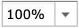
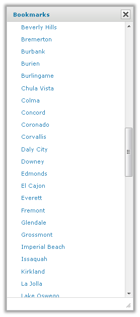
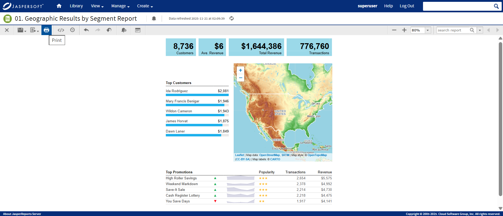

## Moving, Resizing, and Hiding Columns

Columns are easily moved, resized, and hidden in your report.

-   To move a column, click the column you want to move, then drag the column left or right into the new position. The indicates where the column is placed.
-   To resize a column, click the column you want to resize, then drag the  until the column is the size you want.
-   To hide a column, click the column you want to hide, then move your mouse over the and select **Hide column**.

## Setting Output Scale

You can determine the display size for any report by using the report scaling options in the Report Viewer tool bar.

-   Click  to zoom in on the report.
-   Click  to zoom out on the report.
-   Click  to open the Zoom Options drop-down menu, and select the percentage by which you want to increase or decrease the size of the displayed report.

## Using the Bookmarks Panel

When working with a report that contains bookmarks, they are displayed in a floating panel. Using this panel, you can jump to designated sections of the report.

*Figure 1: The Bookmarks Panel*

-   To display the Bookmarks panel, click  in the Report Viewer tool bar.
-   To jump to a bookmarked section of the report, click the name of the section in the Bookmarks panel.

# Navigating the Report

If your report has multiple pages, you can use the pagination controls to move through the report quickly.

To navigate the published report

-   Use at the top of the Report Viewer to navigate to the previous page.
-   Use to navigate to the next page.
-   Use  to go to the end of the report.
-   Use  to go to the beginning of the report.
-   If you know the number of the page you want to view, enter the page number in the Current Page indicator box.

# Exporting the Report

To export the report

1.  To view and save the report in other formats, click the **Export** button.

2.  Select an export format from the drop-down. The export options are listed in Table 3‑6.

    <table>
    <caption>
Export File Types
</caption>
    <colgroup>
    <col style="width: 50%" />
    <col style="width: 50%" />
    </colgroup>
    <thead>
    <tr>
    <th>
Option
</th>
    <th>
Usage
</th>
    </tr>
    </thead>
    <tbody>
    <tr>
    <td>
<strong>PDF Document (.pdf)</strong>
</td>
    <td>
Choose a report template based on report size. Use the Actual Size report template for reports with dimensions less than or equal to 14400px by 14400px. See <a href="reports-running-simple.md">1.1.3, “Report Templates,” on page 1</a> for more information.
</td>
    </tr>
    <tr>
    <td>
<strong>Comma Separated Values (.csv)</strong>
</td>
    <td>
Characters outside the Latin 1 character set can cause the Excel spreadsheet to look unacceptable. Try saving the file and importing it using Excel's Import functionality.
</td>
    </tr>
    <tr>
    <td>
<strong>Microsoft Word (.docx)</strong>
</td>
    <td>
Do not export reports having more than 63 columns. In Microsoft Word, you cannot create tables having more than 63 columns.
</td>
    </tr>
    <tr>
    <td>
<strong>Rich Text Format (.rtf)</strong>
</td>
    <td>
It creates a large output file and, therefore, takes longer to export than PDF, for example.
</td>
    </tr>
    <tr>
    <td>
<strong>OpenDocument Text (.odt)</strong>
</td>
    <td>
For best results, minimize the number of rows and columns to make sure that they don’t overlap.
</td>
    </tr>
    <tr>
    <td>
<strong>OpenDocument Spreadsheet(.ods)</strong>
</td>
    <td>
Same as ODT.
</td>
    </tr>
    <tr>
    <td>
<strong>Microsoft Excel - Paginated(.xlsx)</strong>
</td>
    <td>
Not recommended for exporting most tables or crosstabs. Repeats headers and footers on each page.
</td>
    </tr>
    <tr>
    <td>
<strong>Microsoft Excel (.xlsx)</strong>
</td>
    <td>
Ignores page size and produces spreadsheet-like output.
</td>
    </tr>
    <tr>
    <td><strong>Microsoft PowerPoint (.pptx)</strong></td>
    <td>Each page of the report becomes a slide in the PowerPoint presentation.</td>
    </tr>
    <tr>
    <td><strong>Comma Separated Values - Metadata (.csv)</strong></td>
    <td>
If the required CSV metadata properties are set in the report, it generates a data-oriented document and provides consistent columns of data, with or without column headers on top of the document. Otherwise, an empty document is generated. It does not preserve the style and formatting information.

    
For more information about setting the CSV metadata properties, see <a href="https://jasperreports.sourceforge.net/sample.reference/jasper/index.html#csvmetadataexport">Exporting to CSV Format Using Report Metadata</a>.
</td>
    </tr>
    <tr>
    <td><strong>Microsoft Excel - Metadata(.xlsx)</strong></td>
    <td>
If the required Excel metadata properties are set in the report, it generates a data-oriented document and provides consistent columns of data, with or without column headers on top of the document. Otherwise, an empty document is generated. It also keeps relevant data with their style and formatting information.

    
For more information about setting the Excel metadata properties, see <a href="https://jasperreports.sourceforge.net/sample.reference/jasper/index.html#xlsxmetadataexport">Exporting to XLSX Format Using Report Metadata</a>.
</td>
    </tr>
    </tbody>
    </table>

3.  Save the report in the export file format, for example PDF, or open the report in the application. 
    If you click the close while export process is running, you are prompted to confirm if you want to stop the export process.

!!! note

    You can export a report with the **Detail Chart Enabled** property as enabled or disabled. This property does not impact output formats like PDF, Excel, PPTX, etc., except the HTML output format.

# Printing Reports

You can print a report and save it to your computer as a PDF.

To print a report

-   Hover over the Print button, and select Print.

 

!!! note

    The available print format is PDF (.pdf) only.
