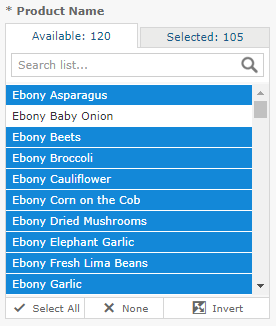

# Multi-select Input Controls

The 16. Interactive Sales Report has an example of a multi-select input control for Product Name.

To run a report with a multi-select input control

1.  In the repository, locate and run the report 16. Interactive Sales Report.
2.  In the Filters panel, enter **onion** in the Search list  for the Product Name input control. 
    Only products containing "onion" are shown.
3.  Click the first item in the list, then scroll down and Shift-click to select all the items with "onion".
4.  Click in the Search list again and delete the word **onion**. 
    All items are displayed, with ones that include "onion" selected.
5.  Click the **Selected** tab to see that only items that are selected are displayed. Then click the **Available** tab to view all the items.
6.  Click **Invert**  to invert the selection. 
    Now all items are selected except those items that contain "onion".
7.  Click **Apply** at the bottom of the panel. The report shows data only for products that do not contain the word "onion."

*Figure 1: Multi-Input Control Selection*
