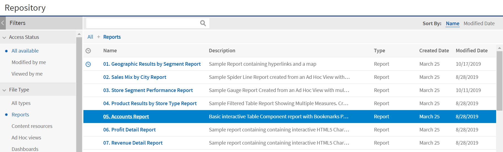
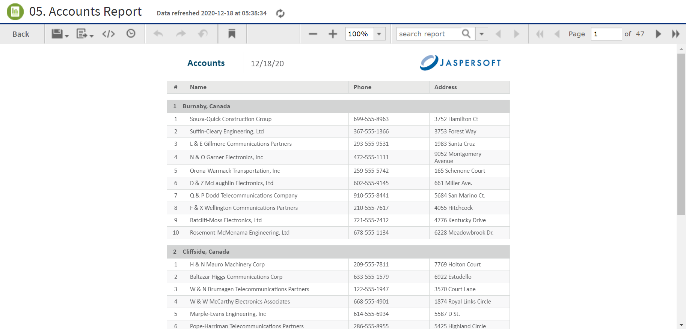

# Running or Creating a Simple Report

You can view and work on a report in the Report Viewer in a number of ways:

- Running an instance of an existing report

- Creating a new report from an existing Ad Hoc view

## Running a Simple Report

This section describes how to run a tabular report that lists account data.

To run a report

1.  Log in to the server as an administrator, such as jasperadmin.

2.  On the Home page, click the large icon in the **Reports** block. 
    The search results appear, listing your own files and other files that your user account has permission to view. If you log in as jasperadmin, 05. Accounts Report appears in the search results.

    

    *Figure 1: Search Results Listing*

3.  To run a report, click the name of a report in the repository. For example, click **05. Accounts Report**. The report appears, as shown in Figure 3‑2.

*Figure 2: Output of the Accounts Report*

!!! note

    If you are running a report with multiple pages, the first page of the report appears before the entire report is loaded. You can begin scrolling through report pages as they load, as indicated in the pagination controls in the upper left corner of the Report Viewer.

    If you want to cancel loading the report before it is complete, click the **Cancel Loading** button that appears next to the pagination controls.

!!! warning

    Rhino JavaScript engine has been removed from JasperReports Server. With the removal of Rhino JS, reports created using JavaScript do not function unless you add Rhino JS back to your deployment. This can be done by stopping the web server, downloading version 1.7.14, which at the time of writing is not known to have any CVEs. This file can be replaced into the WEB-INF/lib folder, and reports that rely on JavaScript again becomes functional.

## Creating a Report

You can create a report directly from the Jaspersoft Server Home page. This method allows you to select an existing Ad Hoc view and generate a report from it, without going through the Ad Hoc Editor.

To create a report from the Home page

1.  On the Home page, click **Create** in the **Reports** block. The Create Report wizard opens.
2.  Select the Ad Hoc view that you want to use as the basis for your report.
3.  Select a report template. To use a template other than the default, select Custom Report Template, click Browse, and select the desired template. See 1.1.3, “Report Templates,” on page 1 for more information.
4.  Click **OK**. If asked, enter the input controls needed. See [Using Input Controls](../adhoc/adhoc-input-controls.md).

You can now begin working with your report. If you close the report without saving the changes, you are prompted to save or cancel the changes made to the report.

## Report Templates

When you create a report, the Create Report wizard displays layout options for generating and exporting the report:

- **Default Report Template** applies basic layout options to your report. This is usually the Actual Size template.

- **Custom Report Template** allows you to browse to an existing template. JasperReports Server includes a number of templates are available by default, including:

  - A4 Landscape
  - A4 Portrait
  - Actual Size
  - Letter Landscape
  - Letter Portrait.

Other report templates may be available. Report templates can be created in Jaspersoft Studio and uploaded to JasperReports Server.

- **Report Generator** allows you to create a highly customized report design. This option is not often enabled. See your JasperReports Server administrator for more information.

Most commonly, you choose the **Default Report Template**.

### Using Report Templates for PDF

If you are exporting your report to PDF, choose your option based on the size of the output.

- For most PDF exports, you can use Actual Size, which supports a maximum size of 14400px by 14400px.

- For reports with an output height exceeding 14,400 px, use a paginated report template that is wide enough for your report. For example, if you have a long report with width less than 842px, you can use the paginated A4 Landscape theme. A report designer can create additional custom templates in Jaspersoft Studio. Contact your administrator for more information.

- Reports with output width exceeding 14,400 px are truncated in PDF. Redesign your report or use a different export format.
