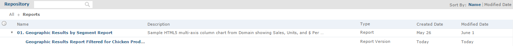
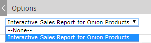

# Saving Input Control Values

You can save your selected input control values to use at another time to have the original report and a copy of it. The JasperReports Server saves a version of the report with the selected values as a child of the original report. This new version of the report appears as a child of the original report in the repository, as shown in Figure 1. Click  next to the original report in the repository to see all versions of it.

Your saved input control values also appear in a dropdown list when you open the input controls dialog.

*Figure 1 Filtered Version of Geographic Results Report in Repository*

To save the input control values

1.  In the repository, locate and run the report 1. Geographic Results by Segment Report.

2.  On the tool bar, click .

3.  Select all of the onion products, as described in [Multi-select Input Controls](reports-multiselect-input-controls.md).

4.  Click save at the bottom of the dialog.

5.  Enter "Interactive Sales Report for Onion Products" as a name for the input control values and click **Save**. 
    JasperReports Server saves the input control values as an option. A new dropdown box appears at the top of the Filters panel.

    

    *Figure 2 Saved Input Controls Option*

6.  Select Interactive Sales Report for Onion Products from the list of options and click **OK**. The report shows data for onion-related products only.
