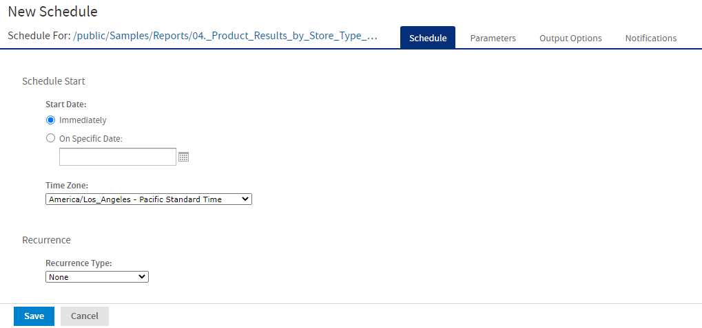

# Scheduling a Report

You can schedule a report from the Report Viewer.

To schedule a report

1.  On the Report Viewer toolbar, click Schedule icon to open the **New Schedule** dialog.

    

    *Figure 1: New Schedule Dialog*

    The **New Schedule** dialog has the following tabs:

    - Schedule – When to run the scheduled job, and how often.
    - Parameters – If the report was designed with input controls, which parameters the scheduled job uses.
    - Output Options – The name of the output file, the output format and locale, and where the output file is stored.
    - Notifications – Email options for sending the output to recipients and for sending administrative messages.

2.  Create the schedule, as described in [Creating a Schedule](../schedules/schedules-job.md).

3.  Click **Save**. The **Save** dialog appears.

4.  In the **Scheduled Job Name** field, enter a name for the job. The description is optional.

5.  Click **Save** to save the schedule. The job appears in the list of saved jobs for reports.

!!! note

    You can schedule a report with the **Detail Chart Enabled** property as enabled or disabled. By default, in the scheduled report, HTML5 charts are not interactive in the HTML output. To make them interactive in the HTML output, you need to update the `jasperReportsProSchedulerContext` bean in the `applicationContext-adhoc.xml` file.

For information on viewing, modifying, or deleting the schedules, see [Scheduling Reports and Dashboards](../schedules/schedules-introduction.md).
