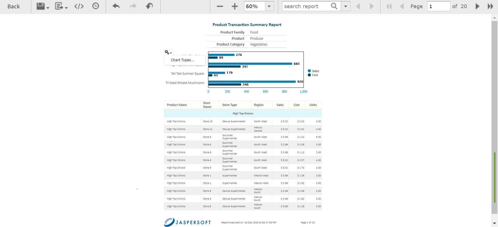
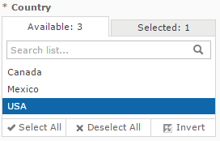

# Simple Input Controls

The 16. Interactive Sales Report example has several input controls:

-   Product Family

-   Product Department

-   Product Category

-   Product Name

-   Country

-   Gender

Using input controls, you run the report with one set of data and then another. When saved, an instance of the report with alternate input controls is called a **Report Version**, and is labeled as such in the repository.

To run a report with simple input controls

1.  In the repository, locate and run the report 16. Interactive Sales Report.

    

    *Figure 1: Interactive Sales Report*

2.  In the Filters panel, use the Country menu to select USA only.

    

    *Figure 2: Input Control Selection - Country*

3.  Click **Close**, then click **Apply** at the bottom of the panel. The report shows data for the USA only.

4.  Click , then select **Save As**. You are prompted to name the new report.

5.  Enter a new name, then click **Save**.
