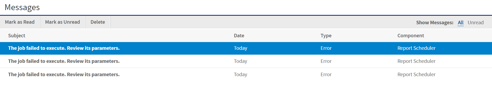

# Event Messages

When an event occurs (for example, a scheduled report returns error), JasperReports Server sends the owner of the job a notification message. You can browse these messages to troubleshoot report scheduling problems in the server. For example, you can determine that a job fails because its data source configuration uses incorrect credentials.

!!! note

    A common cause of the error message indicating that the job failed to execute is an incorrectly configured mail server. The mail server must be manually configured after installation for users to send email notifications.

The Messages page displays the list of events logged for the current user.

To open the Messages page

1.  On any page, click **View &gt; Messages**. The Messages page appears.

2.  To view a message, click its name. The message opens in the Message Detail page.

3.  To activate the buttons on the Messages page, click in a blank area of the message row that you want to manage. The buttons become enabled.

    

    *Figure 1: Message Management Buttons*

4.  Use the buttons on the Messages page to manage the list of messages.
