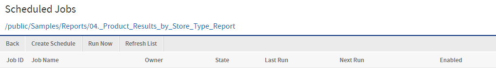
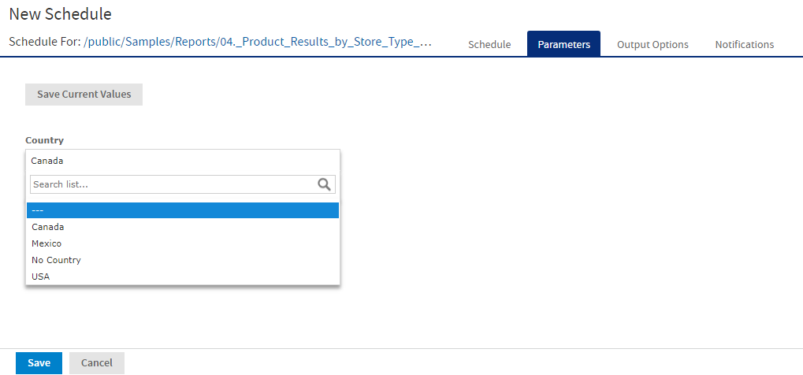

# Creating a Schedule

To create a schedule

1.  Locate the report or dashboard that you want to schedule in the repository.

2.  Right-click the report or dashboard and select **Schedule...** from the context menu, or if it already has a schedule, click the Schedule icon . The Scheduled Jobs page appears.

    

    *Figure 1 Scheduled Jobs Page*

3.  Click **Create Schedule**.

    You can also create a schedule from the dashboard in view and edit mode, and from the report viewer. On the toolbar, click the Schedule icon .

    

    The **Schedule** tab of the scheduler appears.

    

    *Figure 2 New Schedule Tab*

4.  Set a start date, choosing whether to run immediately or on a specific date. If a specific date is selected, click the calendar icon  to select a start date and time.

5.  Specify the time zone for the schedule. The default time zone is the time zone of the server, the time zone you entered at log in. If you are in a different time zone, set this field accordingly.

6.  Choose a recurrence setting, as described in [Running a Job Repeatedly](schedules-repeated.md). If you select Simple or Calendar Recurrence, additional controls appear on the page.

    -   **None**: Run the job once.

    -   **Simple**: Schedule the job to recur at a regular interval, specified in minutes, hours, days, or weeks.

    -   **Calendar**: Schedule the job to recur on days of the week, days of the month, specific dates, or date ranges.

        !!! warning

            If you set up a job with simple recurrence to start immediately, the job schedule will change after export/import or a server restart. This happens because the job does not retain the previous run history and therefore starts immediately after import or restart. If you have a large number of scheduled jobs, all scheduled jobs with simple recurrence will attempt to start at the same time after export/import or restart. This can impact server performance. In addition, some scheduled jobs may be locked out and they may continue to try to run.

            To ensure a recurring schedule does not change after export/import or restart, either use a simple recurrence with a specific start time, or set up calendar recurrence.

7.  If the report or dashboard you are scheduling has input controls that prompt for user input, click the Parameters tab.

    

    *Figure 3 Set the Parameter Values Page for Scheduling a Report*

    Saved values, if there are any, appear in a dropdown list at the top of the page, as shown in Figure 3‑17. In the **Use saved values** dropdown, you can set the input controls defined for the report or dashboard you are scheduling. You can set the input values for the scheduled job, and click **Save Current Values** to save the input value as a named set of values.

    For more information about using saved values and saving input values, see [Running a Report with Input Controls or Filters](../reports/reports-input-controls.md).

8.  Choose a set of saved values, or set the input controls.

9.  Click the Output Options tab and set the output format and location, as described in [Setting Output Options](schedules-output.md).

10. Click the Notifications tab and set up email notifications, as described in [Setting Up Notifications](schedules-notifications.md)

11. Click **Save**. The Save dialog appears.

12. In the **Scheduled Job Name** field, enter a name for the job, for example, Weekly Report. The description is optional.

13. Click **Save** to save the schedule. The job appears in the list of saved jobs for the report or dashboard.
