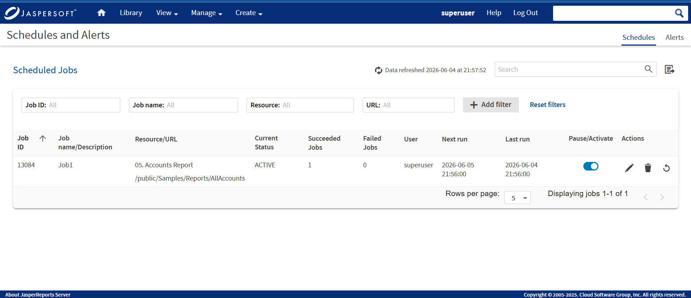
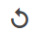

# List of Scheduled Jobs

All scheduled jobs that you have defined appear on the **View &gt; Schedules and Alerts &gt; Schedules** tab. Typical users can see only the jobs that they have defined. Administrators can view the jobs defined by all users.

The view of the Schedules page has been improved with the newly added columns and updates to existing column names.

The Schedules page shows the following:

| Column Name | Description |
|----|----|
| **Job ID** | The unique identifier of a job. |
| **Job name/Description** | Name of the scheduled job and description. |
| **Resource/URL** | Repository URL of the job. |
| **Current Status** | The status of the job in **NORMAL**, **EXECUTING**, **COMPLETE**, **PAUSED**, **ERROR**, or **UNKNOWN** state. |
| **Succeeded Jobs** | The jobs that are completed successfully without any errors. |
| **Failed Jobs** | The jobs that are triggered but encountered an error and did not complete successfully. |
| **User** | The owner who created the job. |
| **Next run** | Filters by date and time to view the count and list of schedules that will run next at the filtered time. |
| **Last run** | Filters by date and time to view the count and list of schedules that was run last at the filtered time. |
| **Pause/Activate** | Enables or disables the job. |
| **Actions** | Edit, delete, or restart the job. |

*Figure 1: The Schedules Page*

In the Schedules page, you can now do the following tasks:

| Functionality | Description |
|----|----|
| **Sort** | You can sort any column except the Actions column in ascending or descending order. Hover on the column header and then click the sort icon  to view the schedules in ascending or descending order. |
| **Filter** | You can filter to find information of the scheduled jobs of the report using the **Add Filter** button. Based on the selected filter settings, the Schedules page is refreshed without effecting the other filters on the page. Select the **Reset filters** to reset the Schedules page to the default filter values. |
| **Data refresh** | You can view the latest updated date and time of new schedules. Click the data refresh icon  to refresh the scheduled job with the recent date and time. |
| **Search** | You can find a scheduled job by job name from the list of available or created schedule. Click the search icon  to search by schedule job name. The search criteria show results for only those job names that match with the names available in the **Job name/Description** column. |
| **Export** | You can export the schedule jobs in CSV format. Click the export icon  to download and view the report of all the scheduled jobs. |

You can use the Schedules page's search field to find the scheduled job you want.

In the Status column, you can view the following job states:

| Job States | Description |
|----|----|
| **NORMAL** | The job is scheduled. The status of this job state is displayed as ACTIVE on the UI. |
| **EXECUTE** | The server is generating the output. The status of this job state is displayed as RUNNING on the UI. |
| **COMPLETE** | The server has finished running the job and output is available in the repository. |
| **PAUSED** | The job has been disabled. Click the **Pause/Activate**  toggle switch to resume the schedule. The status of this job state is displayed as PAUSED on the UI. |
| **ERROR** | The scheduler encountered an error while scheduling or triggering the job. This does not include cases where the job is successfully triggered, but an error occurs while it runs. |
| **UNKNOWN** | The scheduler encountered an error with the job trigger. |

The Schedules page includes the following controls:

| Schedule Page Controls | Description |
|----|----|
|  | **Pause/Activate** toggle switch, when enabled, the job state is set to **ACTIVE**. When disabled, the job state is set to **PAUSED**. |
|  | Edits the scheduled job. |
|  | Deletes the scheduled job. When the server receives a request to delete a job that is running, the server completes running the job before deleting it. |
|  | Restarts the job. |
|  | Displays the previous instance of the search term. |
|  | Displays the next instance of the search term. |
|  | Displays the number of schedule records. By default, five rows per page are displayed. You can change the number of rows per page to 5, 10, 25, or 100. Based on your selection, records are displayed. The total count of records in the schedule job page is equivalent to the number of rows selected per page. |

# Viewing scheduled jobs for an individual report or dashboard

Scheduled jobs appear in the repository with the Schedule icon  (beside the report or dashboard's name).

To view the list of scheduled jobs for a report or dashboard.

1.  Locate the report or dashboard in the repository.
2.  Click the Schedule icon  or right-click the report or dashboard, and select **Schedule** from the context menu. The Scheduled Jobs page is displayed. The Scheduled Jobs display information that is similar to the Schedules page.

!!! note

    You can filter search results for scheduled jobs in the repository using the following options: Any schedule (scheduled and unscheduled reports), **Scheduled**, **Scheduled by me**, or **Not scheduled**. For more information, see [1.0.1, “Filtering Search Results,” on page 1](../introduction/intro-filtering-search.md).

The Scheduled Jobs page includes the following buttons:

| Button | Description |
|----|----|
| Back | Returns to the repository. |
| Create Schedule | Opens the Schedule tab to define a new job. |
| Run Now | Opens the scheduler to run the job immediately. See [Running a Job in the Background](schedules-background.md). |
| Refresh List | Refreshes the list of jobs, for example to see if a job has finished running. |

As an Excel (.XLS) format is deprecated, old scheduled jobs that export reports to Excel (XLS) or Excel Paginated (XLS Paginated) now export reports to Microsoft Excel (.xlsx) or Microsoft Excel - Paginated (.xlsx) format.

# Editing Schedules

If the start date for a schedule has not yet passed, you can edit the schedule. After the start date for a schedule has passed, create a schedule rather than changing the start date.

To edit a schedule

1.  Click **View &gt; Schedules and Alerts &gt; Schedules**.

2.  Click the Edit icon  in the row of the job that you want to update.

3.  Edit the fields in the **Schedule**, **Parameters**, **Output Options**, and **Notifications** tabs.

    !!! note

        See [Creating a Schedule](schedules-job.md) section in JasperReports Server User Guide and repeat from steps 4-10.

4.  Click **Save**. The update occurs immediately.

# Pausing a Job

To stop a job from running without deleting it, disable the job.

To pause a scheduled job

1.  Click **View &gt; Schedules and Alerts &gt; Schedules**.

2.  In the row of the job that you want to stop, disable the **Pause/Activate** toggle switch.

    !!! note

        You can resume the job by enabling the **Pause/Activate** toggle switch. When a stopped job is re-enabled, it waits until the next scheduled time to run.

# Deleting a Job

To delete a scheduled job

1.  Click **View &gt; Schedules and Alerts &gt; Schedules**.

2.  Click the delete icon  in the row of the job you want to delete. A confirmation dialog with a warning message is displayed to confirm if you want to delete this job.

3.  Click **Delete** to delete the scheduled job or click **Cancel** to cancel the delete action.
