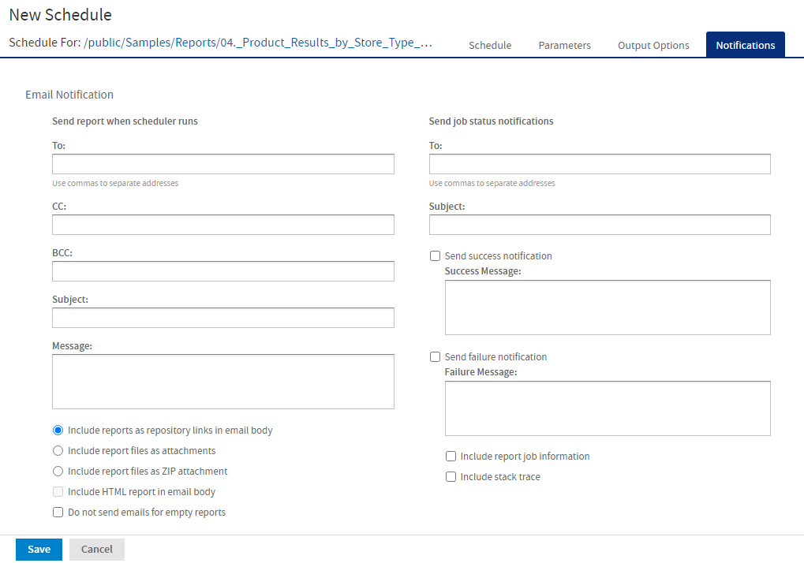

# Setting Up Notifications

On the Notifications page, you can set up email notifications to the recipients of the report or dashboard and to administrators.

!!! note

    Notifications are sent to all users with the organization ROLE_ADMINISTRATOR role, who belong to the same organization as the user who creates the scheduled job.

## Send a report when the scheduler runs

Enter one or more email addresses to send the output after the job has run. You can configure the following:

- **To** – One or more email addresses separated by commas for sending email notification.

  

  
Note

  
By default, the mail server is not configured by the JasperReports Server installer. To send email notifications, the administrator must configure the mail server, as described in the JasperReports Server Installation Guide.

  

- **CC** – One or more email addresses separated by commas for sending an email notification on the CC line.

- **BCC** – One or more email addresses separated by commas for sending a blind carbon-copy email notification. The addresses in this field are not revealed to the other recipients.

- **Subject** - The subject line of the notification email.

- **Message** - Content of the notification email.

- Choose one of the radio buttons to specify how email recipients access the output:
  - **Include reports/dashboard as repository links in email body** - Sends a link to the output in the repository. Not available unless **Output to Repository** is selected on the Output Options tab.

  - **Include report/dashboard files as attachments** - Sends the output as attachments to the notification email. If you have selected multiple output formats, each one is attached as a separate file to the email notification.

  - **Include report/dashboard files as ZIP attachment** - Zips all outputs into a single archive file before attaching to the email.

  - **Include HTML report in email body** - Displays the report directly in the email body. This option is available only when **Include report files as attachments** or **Include report files as ZIP attachment** is checked and HTML is selected as one of the options on the Output File Options page. When this option is selected, you cannot include a message in the email body. This option is not available for dashboards.

    !!! note

        Be careful when sending reports containing sensitive data by email, either in the email body or as an attachment.

- **Do not send emails for empty reports** - A checkbox option that, if checked, prevents the server from attaching empty report output files to email notifications. This applies to parametrized reports where there is no data that matches the parameters. This option is not available for dashboards.

## Send job status notifications

Enter one or more email addresses to send notification of job success or failure to administrators:

- **To** – One or more email addresses separated by commas for sending email notification.

  

  
Note

  
By default, the mail server is not configured by the JasperReports Server installer. To send email notifications, the administrator must configure the mail server, as described in the JasperReports Server Installation Guide.

  

- **Subject** – The subject line of the notification email.

- **Send success notification** – Checkbox option that, when checked, sends a notification when the scheduled job runs.
  - **Success Message** – The message in the body of the notification email sent on success.

- **Send failure notification** – Checkbox option that, when checked, sends a notification when the scheduled job fails to run.
  - **Failure Message** – The message in the body of the notification email sent on failure.

- **Include report/dashboard job information** – A checkbox option that, if selected, includes the report or dashboard's label, ID, description, and job status in the notification email.

- **Include stack trace** – A checkbox option that, if selected, includes the stack trace for failed jobs in the body of the email.

*Figure 1: Notifications Page for Scheduling a Report*
