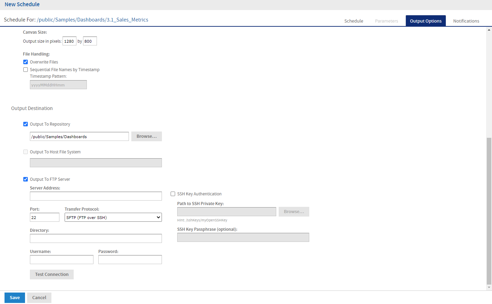

# Setting Output Options

On the **Output Options** tab, you can change these settings:

- **File name** – The base name for the output file in the repository. This name must be unique. If you attempt to create a schedule with the same file name as an existing output file, you will not be able to save the file name.

- **Description** – The optional description of the file that appears to users who view the repository.

- **Time Zone** – The output time zone for generating the report.

- **Output Locale** – The locale settings for generating the report.

- The report must support locales, for example a report based on a Domain with locale bundles. For more information on locale bundles, see JasperReports Server Data Management Using Domains.

- **Export Type** – Click the dropdown menu and select one of the following export types:

  - Screenshot

  - Detailed

    !!! note

        The **Export Type** option is available only for dashboards.

- **Formats** – The available output formats. For dashboards, the available formats for the selected export type is displayed. Select one or more formats. The default format is PDF. When you select more than one, each format is stored as a separate file in the selected output destination.

<table>
<colgroup>
<col style="width: 33%" />
<col style="width: 33%" />
<col style="width: 33%" />
</colgroup>
<thead>
<tr>
<th>Format for Reports</th>
<th>Format for Dashboards(Screenshot)</th>
<th>Format for Dashboards(Detailed)</th>
</tr>
</thead>
<tbody>
<tr>
<td>Comma Separated Values (.csv) 
Web Page (.html) 
Rich Text Format (.rtf) 
Microsoft Word (.docx) 
OpenDocument Spreadsheet (.ods) 
Microsoft Excel (.xlsx) 
OpenDocument Text (.odt) 
Microsoft Excel - Paginated (.xlsx) 
PDF Document (.pdf) 
Microsoft PowerPoint (.pptx) 
Comma Separated Values - Metadata (.csv) 
Microsoft Excel - Metadata (.xlsx)</td>
<td>Microsoft Word (.docx) 
PNG Image (.png) 
OpenDocument Text (.odt) 
Microsoft PowerPoint (.pptx) 
PDF Document (.pdf)</td>
<td>Microsoft Word (.docx) 
PNG Image (.png) 
OpenDocument Text (.odt) 
Microsoft PowerPoint (.pptx) 
PDF Document (.pdf) 
Microsoft Excel (.xlsx) 
Rich Text Format (.rtf) 
Comma Separated Values (.csv) 
OpenDocument Spreadsheet (.ods)</td>
</tr>
</tbody>
</table>

- **Canvas Size** – Sets the size of the canvas when exporting a dashboard.

  

  
Note

  
The <b>Canvas Size</b> field is available only for the <b>Screenshot</b> export type.

  

- **File Handling** – Select one or more checkboxes to specify handling for multiple output files with the same name:

  - **Overwrite Files** – Overwrites old output files with newer ones of the same name.
  - **Sequential File Names by Timestamp** – Appends a timestamp to the names of files created by the job. Useful for the output of recurring jobs or for time-sensitive reports where the output must be dated. When the timestamp is used, the output filename is `<basename>-<timestamp>.<extension>`. Note that, depending on the frequency of the schedule and the format of the timestamp, it may be possible to have two output files with the same name; in this case, modify the timestamp or use the **Overwrite Files** checkbox to specify the behavior you want.
  - **Timestamp Pattern** – When **Sequential File Names by Timestamp** is selected, a required pattern for the timestamp, based on the `java.text.SimpleDateFormat` is required. Valid patterns for output files can contain only letters, numbers, dashes, underscores, and periods. The default pattern is `yyyyMMddHHmm`, for example `200906150601`.
  - For more information about the valid patterns for this field, refer to: 
    <http://download.oracle.com/javase/6/docs/api/java/text/SimpleDateFormat.html>

- **Output Destination** – To save the output file, select one or more checkboxes to specify the output location. If you do not want to save the report output (for example, if you only want to email the report) leave all checkboxes blank.

  - **Output To Repository** – If checked, saves the report output to the specified location in the repository. You must have write permission to the output folder. JasperReports Server validates the path when you click **Save**. It displays an error message if the location does not exist. You can change the repository location that appears here by default. See JasperReports Server Administrator Guide for more information.

  - **Output To Host File System** – If checked, saves the report output to the specified folder on the Server host machine. Check with your administrator for the correct location to enter. **Output To Host File System** must be configured by an administrator. If the checkbox is grayed out, saving to the host file system has not been enabled for your system. See the JasperReports Server Administrator Guide for more information

  - **Output To FTP Server** – If checked, saves the report output to the specified FTP server. You must have write permission to the selected directory on the FTP server. Enter the following properties of your FTP server:

    - **Server Address** – The host, IP address, or URL of the FTP server.

    - **Port** – Specifies the FTP connection port.

      - For FTP, the default port is 21.
      - For FTPS, the default port is 990.
      - For SFTP, the default port is 22.

    - **Transfer Protocol** – Specifies the file transfer protocol that the server uses. You can select one of the following:

      - **FTP**.
      - **FTPS (FTP over SSL)**.
      - **SFTP (FTP over SSH)**. If selected, the **SSH Key Authentication** checkbox and SSH private key fields appear.

    - **SSH Key Authentication**. Check if the server requires an SSH private key for SFTP transfers.

    - **Path to SSH Private Key**. When **SSH Key Authentication** is checked, the location of the SSH private key in the repository is required.

    - **SSH Key Passphrase**. When **SSH Key Authentication** is checked, enter the passphrase for the SSH private key, if it has one.

    - **Directory** – The directory on the FTP server where the report output is saved.

    - **Username** – The username for access to the FTP server.

    - **Password** – The password for the username.

  

  *Figure 1: Output Page for Scheduling a Dashboard – Output Destination*

When you click **Save**, the job appears in the list of scheduled jobs.
