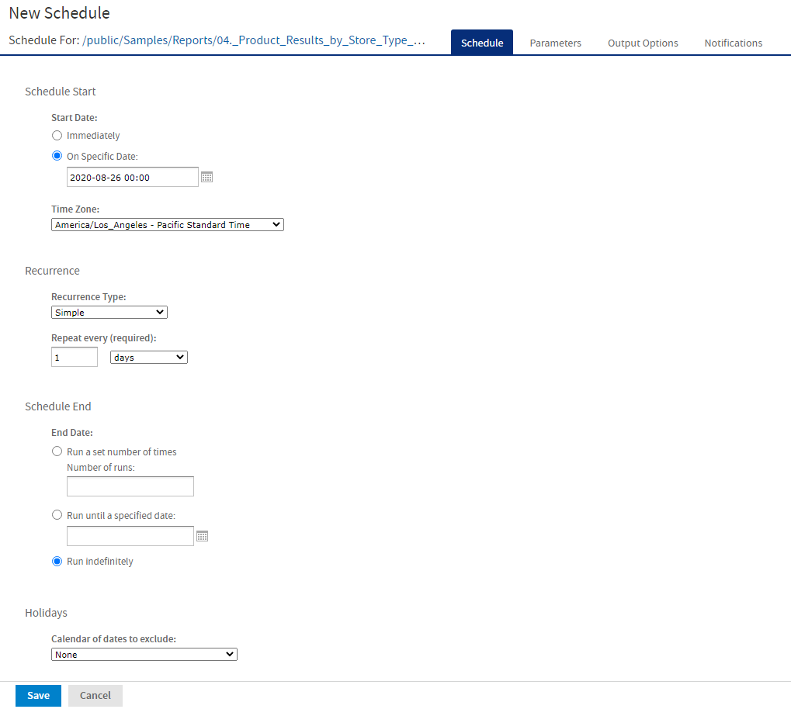
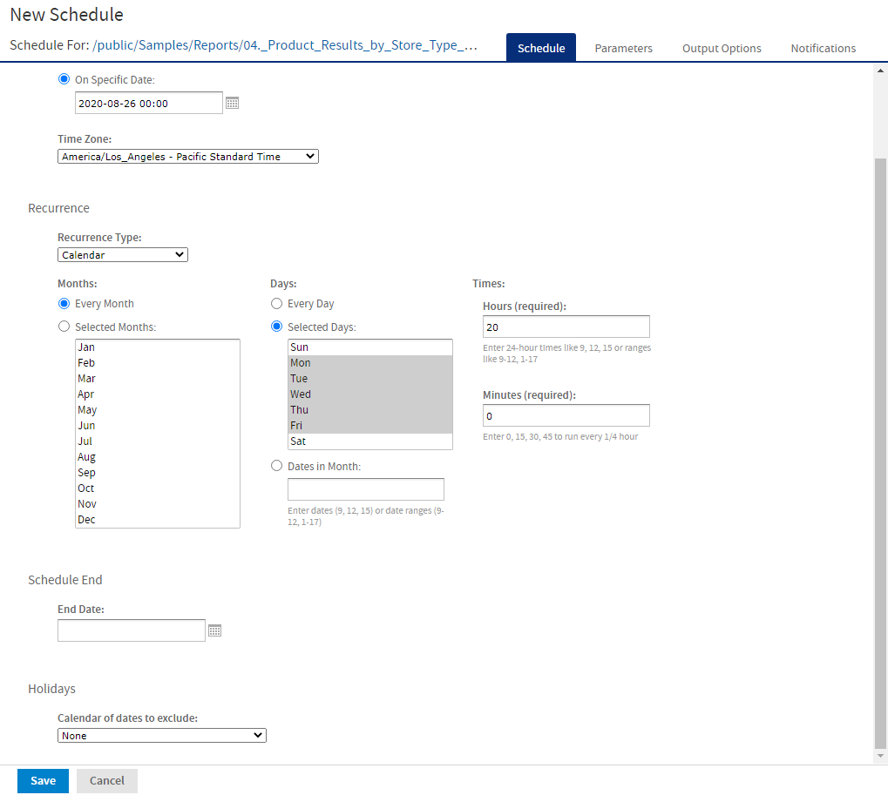

# Running a Job Repeatedly

To run jobs automatically regularly, select a simple or calendar recurrence on the Schedule tab:

-   **Simple** recurrence repeatedly runs the job at a regular interval set in minutes, hours, days, or weeks.

-   **Calendar** recurrence involves more settings: time of day, days of the week, or days of the month, and months of the year.

In Figure 1-1 you can see an example of how to set a simple recurrence.

*Figure 1: Simple Recurrence Settings*

Simple recurrence options are:

-   **Repeat every** – The interval between jobs, in minutes, hours, days, or weeks.

-   **Run a set number of times** – Runs the specified number of times.

-   **Run until a specified date** – Runs until a calendar date is reached. Click the calendar icon  to select the date.

-   **Run indefinitely** – Runs at the specified time until you delete the job.

-   **Holidays** – A holiday calendar specifies a list of days when the scheduled job does not run. To use a holiday calendar, select it from the dropdown list. Only one holiday calendar can be selected at a time. Holiday calendars are configured by an administrator. If no calendars are available in this list, then this implies that this option has not been configured for your system.

    !!! note

        If your server recognizes Daylight Savings Time (DST), jobs scheduled using simple recurrence may seem to occur one hour later (when DST ends) or one hour earlier (when DST begins). If you want jobs to recur at the same time of day and respect DST adjustments, use calendar recurrence.

    !!! warning

        If you set up a job with simple recurrence to start immediately, the job schedule will change after export/import. This happens because the imported job does not retain the previous run history and therefore starts immediately after successful import. To ensure a recurring schedule does not change after export/import, either use a simple recurrence with a specific start time, or set up calendar recurrence.

In Figure 3‑21 you see an example of calendar recurrence settings.

*Figure 2: Calendar Recurrence Settings*

Calendar recurrence options are:

-   **Months** – The months during which the job runs.

    -   Every Month
    -   Selected Months

-   **Days** – The days when the job runs.

    -   Every Day
    -   Selected Days
    -   Dates in Months – Enter dates or date ranges separated by commas, for example: `1, 15`.

-   **Times** – The time of day in minutes and hours when the job should run. The hours use the 24-hour format.

You can also enter multiple minutes or hours, and ranges, separated by commas. For example, entering `0,``15,``30,``45` for the minutes, and `9-17` for the hours, runs the report every 15 minutes from 9:00 a.m. to 5:45 p.m. Enter an asterisk (`*`) to run the job every minute or every hour.

-   **End Date** – Calendar recurrence runs until a calendar date is reached. Click  to select the date.
-   **Holidays** – A holiday calendar specifies a list of days when the scheduled report does not run. To use a holiday calendar, select it from the dropdown list. Only one holiday calendar can be selected at a time. Holiday calendars are configured by an administrator. If no calendars are available in this list, then this implies that this option has not been configured for your system.

Administrators see the chapter on scheduling in the JasperReports Server REST API Reference for more information on configuring calendars.
