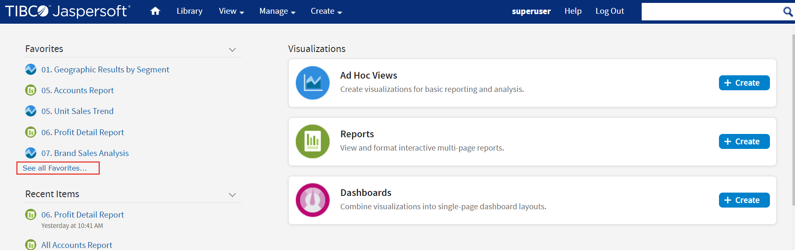
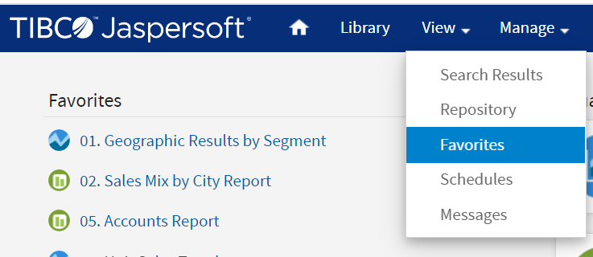

# Accessing Favorites

Once you have added the items to Favorites, you can access those items quickly in your Favorites list. The Favorites list can be accessed in the following ways:

- Home page - On the Home page, a Favorites list appears above the Recent Items list. The Favorites list displays the top five runnable items, sorted alphabetically, such as reports, Ad Hoc views, OLAP views, and dashboards. You can access these items by clicking them, if you want to see the list of all items added to Favorites, click **See all Favorites**. This takes you to the Search Results page with the **Favorites** filter.

Favorites option on Home Page

- View Menu - In the View menu, the Favorites option is available. When you select the Favorites option, the Search Results page appears with the **Favorites** filter selected in the left panel.

Selecting Favorites from View Menu

- Search Results Page - On the Search Results page, in the Filters panel, the Favorite Status section allows you to filter the list and show a list of items that are added to Favorites. When you click the Favorites filter, the Favorites list displays all the items added to Favorites.

Favorites Filter on Search Results Page

- Repository Page - You can access the reports, dashboards, and other files with the solid blue star icon on the Repository page.

Accessing Favorites List on Repository Page

- Library - On the Library page, you can see the list of all files, but the files with a solid star icon to the left of the file name are added to Favorites. You can also apply the filter to see a Favorites list. To filter the list, turn on the **Show favorites only** toggle, a Favorites list appears on the Library page.

All Files when **Show favorites only** toggle is not selected

Favorites List when **Show favorites only** toggle is selected
