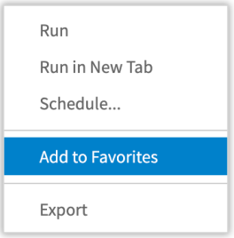
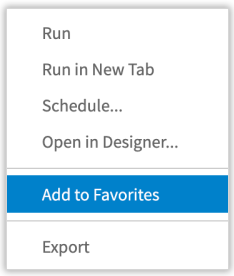

# User Favorites

JasperReports Server user Favorites enables you to add the repository resources to your Favorites. By adding repository objects to Favorites, you can access frequently used files quickly in your Favorites. Using user Favorites, you can add, remove and access the repository objects in the Favorites list, including reports, dashboards, Ad Hoc views, domains, and data sources.

This chapter includes the following sections:

-   Adding Resources to Favorites
-   [Removing Resources from Favorites](within-object.md)
-   [Accessing Favorites](accessing-fav.md)

## Adding Resources to Favorites

User Favorites lets you add the repository objects using a star icon or option in the context menu. You can add the multiple objects of different types to your Favorites list in the following ways:

### File Listing Page

You can add the items to Favorite in the Library page, Repository page, and Search Results page. In the Library page, you can add only Ad Hoc views, reports, and dashboards to the Favorites list, while in the Repository page and Search Results page, you can add reports, dashboards, Ad Hoc views, domains, data sources, and other files also to the Favorites list.

The following example shows you to add items in the Library page.

To add an item to Favorites using the star icon

1.  Click Library and hover over the library list.
2.  Select any item from Ad Hoc views, dashboards, and reports and click the star icon to the left of the item name. The item will be added to Favorites.
3.  Repeat the step 1 and step 2 to add more items to your Favorites list.

*Figure 1: Item Added to Favorites*

Similarly, you can add the other files to the Favorites in Repository page and Search Results page.

To add an item to Favorites using the context menu

1.  Click Library and hover over the library list.
2.  Select a report you want to add to Favorites.
3.  Right-click the report and select **Add to Favorites** from the context menu.
4.  To select multiple items, use the shift or control key with arrow keys, and then right-click the selected items and select **Add to Favorites** from the context menu. The multiple items will be added to Favorites at once.

*Figure 2: Adding Report to Favorites*

Each object type has different options in its associated context menu. See the table below for the **Add to Favorites** option for each object type.

<table>
<colgroup>
<col style="width: 25%" />
<col style="width: 25%" />
<col style="width: 25%" />
<col style="width: 25%" />
</colgroup>
<tbody>
<tr>
<td>Object Type</td>
<td>Library</td>
<td>Repository Browse</td>
<td>Repository Search</td>
</tr>
<tr>
<td>Ad Hoc Views</td>
<td></td>
<td></td>
<td></td>
</tr>
<tr>
<td>Reports</td>
<td></td>
<td></td>
<td></td>
</tr>
<tr>
<td>Dashboards</td>
<td></td>
<td></td>
<td></td>
</tr>
<tr>
<td>
Data Sources

Domains
</td>
<td> </td>
<td></td>
<td></td>
</tr>
<tr>
<td>
Datatype

Input Control

Content Resource

List of Values

OLAP Client Connection

Mondrian XML/A Source

Query
</td>
<td> </td>
<td></td>
<td></td>
</tr>
<tr>
<td>JasperReport</td>
<td> </td>
<td></td>
<td></td>
</tr>
<tr>
<td>OLAP View</td>
<td> </td>
<td></td>
<td></td>
</tr>
<tr>
<td>
File:

Access Grant Schema

Content Resource

CSS

Font

Image

JAR

JRXML

OLAP Schema

Resource Bundle

Style Template

XML
</td>
<td> </td>
<td></td>
<td></td>
</tr>
</tbody>
</table>
